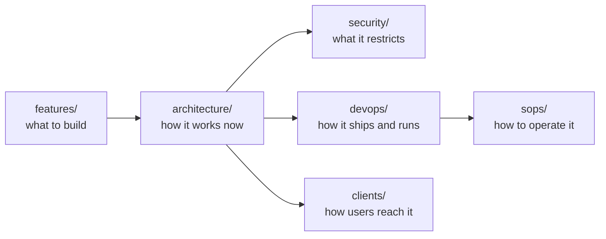

# Plane Docs

This is the landing page for `docs/`. It answers one question: where does a given piece of knowledge live?

Read [`AGENTS.md`](./AGENTS.md) before you add or edit any page.

## Layout

```
docs/
├── architecture/     How Plane works today
│   └── c4/             The four C4 zoom levels
│       ├── context/      L1  Actors and external systems
│       ├── containers/   L2  Deployable units and flows across them
│       ├── components/   L3  Modules and stores inside one container
│       └── code/         L4  One hard algorithm (rare)
├── clients/          Every way to consume Plane
├── devops/           How the code ships, runs, and stays watched
│   ├── cicd/           Pipelines and required checks
│   ├── monitoring/     Signals, alerts, and dashboards
│   └── infra/          Deployment targets and their components
├── features/         What we plan to build or change
│   ├── new/            New capability specs
│   ├── changes/        Changes to shipped behavior
│   └── bugfixes/       Defect records
├── security/         What Plane restricts, and where it is enforced
└── sops/             Step-by-step operational procedures
```

## Areas

| Area | Use it when you need to know | Index |
| --- | --- | --- |
| Architecture | Where the code lives and how the pieces connect, at four C4 zoom levels | [architecture/INDEX.md](./architecture/INDEX.md) |
| Clients | Which interfaces exist and how a user reaches them | [clients/INDEX.md](./clients/INDEX.md) |
| DevOps | Which pipeline runs, which alert fires, which target deploys | [devops/INDEX.md](./devops/INDEX.md) |
| Features | What a planned or shipped change is meant to do | [features/INDEX.md](./features/INDEX.md) |
| Security | Which restriction exists and which code enforces it | [security/INDEX.md](./security/INDEX.md) |
| SOPs | The exact steps to complete an operational task | [sops/INDEX.md](./sops/INDEX.md) |

## How the areas relate



| Direction | Rule |
| --- | --- |
| `features/` to `architecture/` | When a feature ships, update the architecture page to match the built result, not the proposed design. |
| `architecture/` to `security/` | When a guard, permission, or gate changes, update the matching security catalog page. |
| `architecture/` to `devops/` | When a deployable unit or dependency changes, update the matching infra page. |
| `devops/` to `sops/` | A pipeline or infra page describes the shape. An SOP gives the steps to run it. |

## Standalone pages

- [linting.md](./linting.md) covers how OxLint runs across the monorepo.

## Repo-level guides

These files live outside `docs/`. Read them for code conventions.

- [`../AGENTS.md`](../AGENTS.md) lists build, check, and test commands.
- [`../CONTRIBUTING.md`](../CONTRIBUTING.md) covers setup and the pull request process.
- [`../SECURITY.md`](../SECURITY.md) covers vulnerability reporting.
