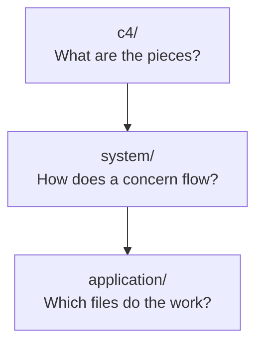

# Architecture

How Plane works today, at three zoom levels. Start wide and drill down.

Read [`AGENTS.md`](./AGENTS.md) before you add a page.

## Zoom levels

| Level | Scope | Index |
| --- | --- | --- |
| **C4** | The product as boxes and arrows: actors, containers, external systems | [c4/INDEX.md](./c4/INDEX.md) |
| **System** | One runtime concern end to end, across two or more apps | [system/INDEX.md](./system/INDEX.md) |
| **Application** | Inside one app: components, stores, models, routes | [application/INDEX.md](./application/INDEX.md) |

## Where to start

| You want to | Read |
| --- | --- |
| Understand Plane for the first time | [c4/l1-context.md](./c4/INDEX.md), then [c4/l2-containers.md](./c4/INDEX.md) |
| Trace a request from browser to database | [system/INDEX.md](./system/INDEX.md) |
| Change a screen or an endpoint | [application/INDEX.md](./application/INDEX.md) |
| Deploy or operate the product | [../devops/INDEX.md](../devops/INDEX.md) |

## Related areas

- [../clients/INDEX.md](../clients/INDEX.md) lists every interface a user or a script can reach.
- [../security/INDEX.md](../security/INDEX.md) lists every restriction and the code that enforces it.
- [../features/INDEX.md](../features/INDEX.md) holds the specs that drove each change.
