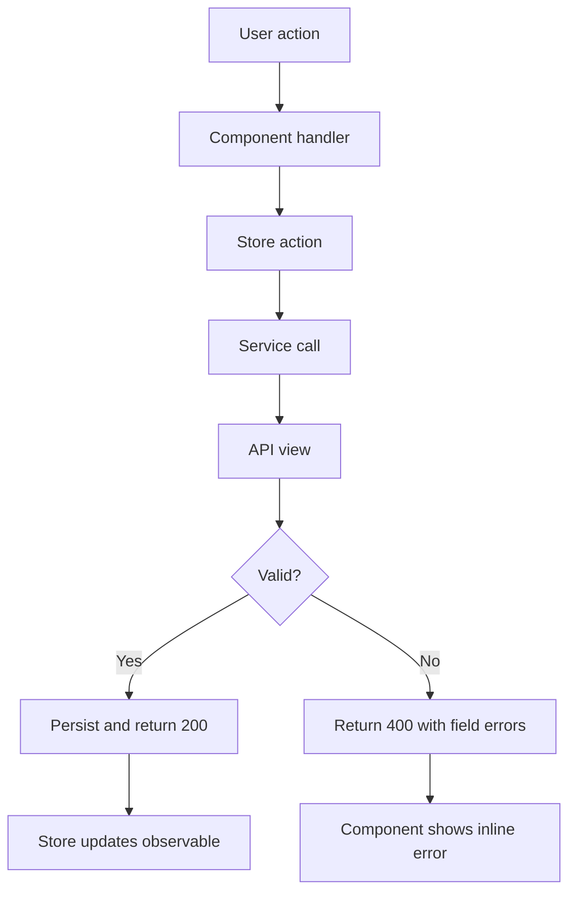

# N. <Journey Title>

> **Last reviewed:** YYYY-MM-DD
> **App:** `apps/web`
> **Scope:** One sentence that states what the user does and what the outcome is.

### Related feature specs

| Spec | Description | Status |
| --- | --- | --- |
| [<Feature name>](../../features/new/<slug>.md) | One-line summary | Shipped / Partial / Draft |

## N.1 <Sub-journey title>

One line on what the user does and the result.

### Key files

Delete a row that does not apply.

| Layer | File |
| --- | --- |
| Route | `apps/web/app/routes/...` |
| Layout | `apps/web/core/layouts/...` |
| Component | `apps/web/core/components/...` |
| Hook | `apps/web/core/hooks/...` |
| Service | `apps/web/core/services/...` |
| Store | `apps/web/core/store/...` |
| Shared package | `packages/ui/...` |
| API URL | `apps/api/plane/app/urls/...` |
| API view | `apps/api/plane/app/views/...` |
| Serializer | `apps/api/plane/app/serializers/...` |
| Model | `apps/api/plane/db/models/...` |
| Background task | `apps/api/plane/bgtasks/...` |

### Key components

**`<ComponentName>`** renders <what>. It <key behavior>. It blocks <user-facing constraint>.

- Background classes: `bg-surface-1` with `bg-layer-1` children. See `packages/tailwind-config/AGENTS.md`.
- Translation keys: `<namespace>.<key>` in `packages/i18n/src/locales`.

### Key state

**`<StoreName>`** (`apps/web/core/store/...`)

| Observable | Type | Purpose |
| --- | --- | --- |
| `<name>` | `<type>` | What it holds and who reads it |

| Action | Effect |
| --- | --- |
| `<actionName>` | What it changes, and which service it calls |

### Key data models

**`<ModelName>`** (`<table_name>` table, `apps/api/plane/db/models/...`)

| Field | Type | Constraints |
| --- | --- | --- |
| `id` | UUID | Primary key, default `uuid4()` |
| `name` | CharField(255) | Not null |
| `created_at` | DateTimeField | Auto add |

- Note any storage decision a reader cannot guess. Example: "Soft-deleted, not removed."

### Data flow

- **Primary path**: The route through the flow when every step succeeds.
- **Branch**: The main decision point and both outcomes.
- **Design choice**: Something a reader cannot guess from the code.

### Acceptance criteria

Write each rule from the code that enforces it. Mark a UI-only rule as "client-side only".

- <Validation rule and where it is enforced>
- <Permission or role boundary>
- <Error handling behavior the user sees>

### Verification

- **Tests**: `apps/api/tests/...`, `apps/web/...`
- **Command**: The exact command that exercises the journey.

---

<!-- Repeat ## N.2 and ## N.3 for each sub-journey in this page. -->
