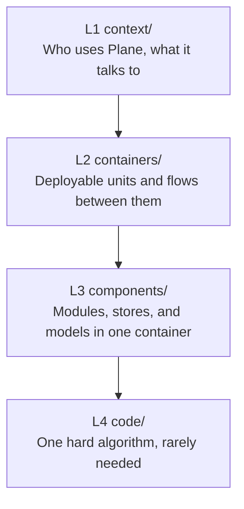

# C4 Architecture

Every architecture page, organized by the four levels of the [C4 model](https://c4model.com/). The four levels cover system architecture and application architecture together.

Read [`AGENTS.md`](./AGENTS.md) for the rules that apply at every level. Each level folder adds its own.

## Levels

| Level | Folder | Scope | Reads as |
| --- | --- | --- | --- |
| **L1** | [context/](./context/INDEX.md) | Actors, Plane as one box, every external system | System architecture |
| **L2** | [containers/](./containers/INDEX.md) | Deployable units, their traffic, and flows across them | System architecture |
| **L3** | [components/](./components/INDEX.md) | Modules, routes, stores, and models inside one container | Application architecture |
| **L4** | [code/](./code/INDEX.md) | Classes and calls for one hard algorithm. Rare. | Application architecture |

Start at L1 for the shape of the product. Drill down only as far as the question needs.

## Supplementary diagrams

C4 defines three optional supplementary types beyond the four levels. This tree adds no fifth folder, because each type files under the level of the elements it shows. [`AGENTS.md`](./AGENTS.md) maps each type to its folder.

## Which page answers my question

| Question | Page |
| --- | --- |
| Who uses Plane, and what does Plane depend on? | [L1 System context](./context/01-system-context.md) |
| Which integrations are optional, and which always phone home? | [L1 System context](./context/01-system-context.md) |
| What runs where, and what talks to what? | [L2 Container overview](./containers/01-container-overview.md) |
| How does a request travel from the browser to the database? | [L2 Request lifecycle](./containers/02-request-lifecycle.md) |
| How is this endpoint authenticated? | [L2 Request lifecycle](./containers/02-request-lifecycle.md) |
| Which Django package owns this endpoint group? | [L3 apps/api](./components/01-api-module-map.md) |
| Which store owns this state, and which service calls the API? | [L3 apps/web](./components/02-web-component-map.md) |
| How does a published board authorize an anonymous reader? | [L3 apps/space](./components/05-space-component-map.md) |
| Which path does the proxy send to which container? | [L3 apps/proxy](./components/06-proxy-component-map.md) |
| How does a keystroke reach Postgres, and what can lose it? | [L4 Document synchronisation](./code/01-document-synchronisation.md) |
| Where do the containers actually run, per environment? | No page yet. See the L2 backlog. |

## Format

Every page uses Mermaid, and every diagram renders on GitHub with no plugin and no build step.

**Never use Mermaid C4 syntax.** GitHub bundles a Mermaid build without the C4 extension, so a `C4Context`, `C4Container`, or `C4Component` block ships as raw text. Use `flowchart` for a structural view and `sequenceDiagram` for a runtime flow. [`AGENTS.md`](./AGENTS.md) holds the node shapes, the colour classes, and the render check that fails loud.

## Related

- [../INDEX.md](../INDEX.md) is the architecture landing page.
- [../../devops/infra/INDEX.md](../../devops/infra/INDEX.md) covers each deployment target in depth.
- [../../security/INDEX.md](../../security/INDEX.md) lists the restrictions these structures enforce.
- [context/01-system-context.md](./context/01-system-context.md) lists the surfaces these containers serve, in Appendix A.
