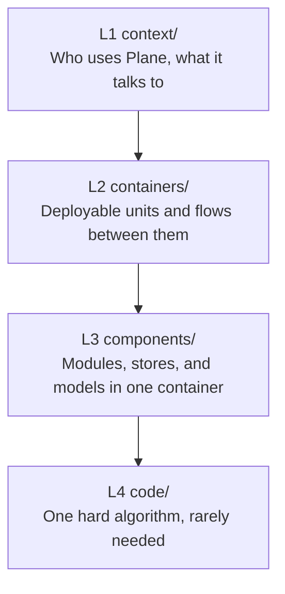

# C4 Architecture

Every architecture page, organized by the four levels of the [C4 model](https://c4model.com/). The four levels cover system architecture and application architecture together.

Read [`AGENTS.md`](./AGENTS.md) for the rules that apply at every level. Each level folder adds its own.

## Levels

| Level | Folder | Scope | Reads as |
| --- | --- | --- | --- |
| **L1** | [context/](./context/INDEX.md) | Actors, Plane as one box, every external system | System architecture |
| **L2** | [containers/](./containers/INDEX.md) | Deployable units, their traffic, and flows across them | System architecture |
| **L3** | [components/](./components/INDEX.md) | Modules, routes, stores, and models inside one container | Application architecture |
| **L4** | [code/](./code/INDEX.md) | Classes and calls for one hard algorithm. Rare. | Application architecture |

Start at L1 for the shape of the product. Drill down only as far as the question needs.

## Supplementary diagrams

C4 defines three optional supplementary types beyond the four levels. This tree adds no fifth folder. Each type files under the level of the elements it shows.

| Type | Shows | Files under | Needed for Plane |
| --- | --- | --- | --- |
| System landscape | Several software systems inside one organization | [context/](./context/INDEX.md) | No. Plane is one software system. |
| Dynamic | Runtime interaction for one feature or use case | [containers/](./containers/INDEX.md) or [components/](./components/INDEX.md) | Yes |
| Deployment | Container instances mapped onto infrastructure, per environment | [containers/](./containers/INDEX.md) | Yes |

A dynamic diagram can sit at more than one level. File it by the elements it names. A flow between `api` and `worker` is L2. A flow between two modules inside `apps/web` is L3.

## Which level answers my question

| Question | Level |
| --- | --- |
| Who uses Plane, and what does Plane depend on? | L1 |
| What runs where, and what talks to what? | L2 |
| How does a request travel from the browser to the database? | L2 |
| Which files build this screen or this endpoint? | L3 |
| Which store owns this state? | L3 |
| Where do the containers actually run, per environment? | L2, deployment kind |
| Why does this one function order things this way? | L4, and usually no page at all |

## Format

Every page uses Mermaid. GitHub, VS Code, and most markdown viewers render it without a plugin. Every diagram has a prose table below it that carries the detail.

## Related

- [../INDEX.md](../INDEX.md) is the architecture landing page.
- [../../devops/infra/INDEX.md](../../devops/infra/INDEX.md) covers each deployment target in depth.
- [../../security/INDEX.md](../../security/INDEX.md) lists the restrictions these structures enforce.
- [../../clients/INDEX.md](../../clients/INDEX.md) lists the surfaces these containers serve.
