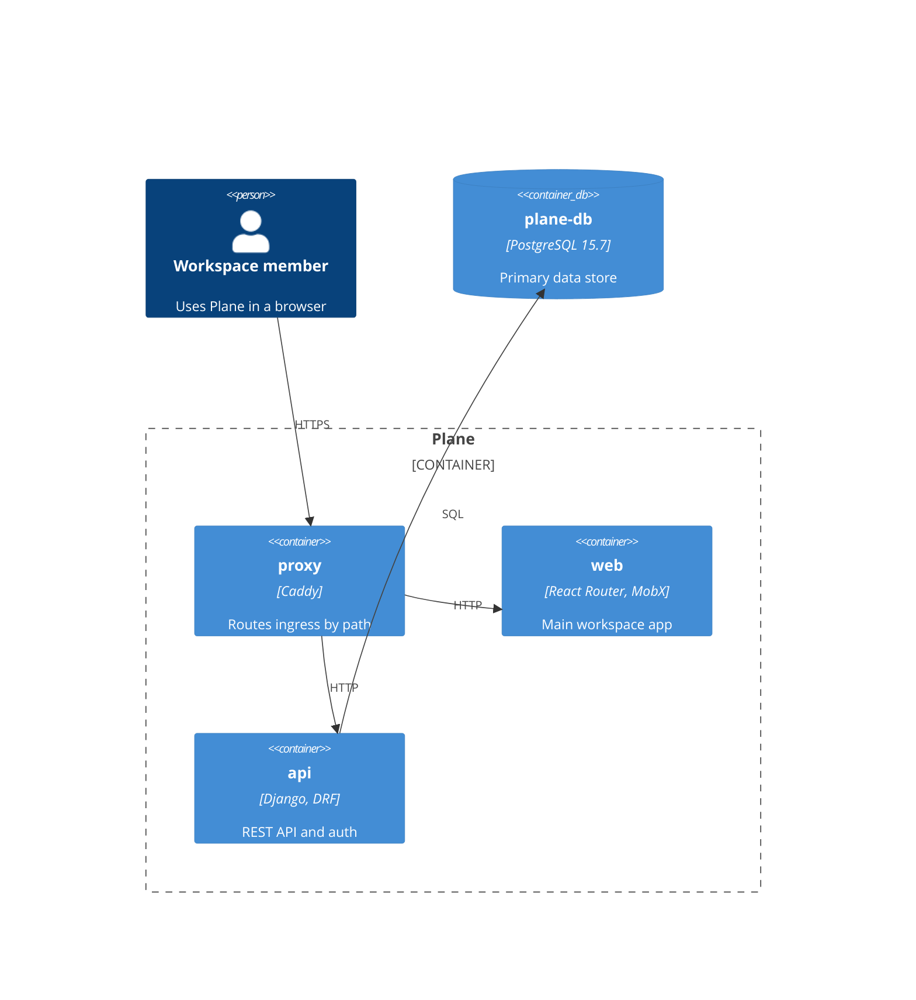

# <Level> - <Title>

> **Last reviewed:** YYYY-MM-DD
> **Level:** L1 Context | L2 Containers | L3 Components | Deployment
> **Scope:** One sentence that states the boundary of this page.

## Diagram

## Elements

Every node in the diagram needs one row. Keep the table and the diagram in sync.

| Node | Technology | Responsibility | Exposure |
| --- | --- | --- | --- |
| `proxy` | Caddy | Terminates TLS and routes ingress by path | Public |
| `web` | Next.js, MobX | Renders the workspace app | Internal |
| `api` | Django, DRF | Serves REST endpoints and authentication | Internal |
| `plane-db` | PostgreSQL 15.7 | Stores workspaces, projects, and work items | Internal only |

## Relationships

| From | To | Protocol | Port | Carries |
| --- | --- | --- | --- | --- |
| `proxy` | `api` | HTTP | 8000 | REST requests |
| `api` | `plane-db` | TCP | 5432 | SQL queries |

## External systems

Delete this section on an L3 page.

| System | Purpose | Data sent | Availability |
| --- | --- | --- | --- |
| <Provider> | <Why Plane calls it> | <Data category> | Community and commercial / Commercial only |

## Trust boundaries

Required on an L1, L2, or Deployment page. Delete on an L3 page.

| Zone | Contains | Exposure |
| --- | --- | --- |
| Internet | <Nodes> | Public |
| Edge | <Nodes> | Public ingress |
| Application | <Nodes> | Internal |
| Data | <Nodes> | Internal only |

## Notes

- **Summary point 1**: The primary path through the diagram.
- **Summary point 2**: The main failure mode or branch.
- **Summary point 3**: A design choice a reader cannot guess.

## Related pages

| Page | Why it matters here |
| --- | --- |
| [<Journey page>](../application/NN-slug.md) | File-level detail for <node> |
| [<System page>](../system/NN-slug.md) | End-to-end flow through <node> |
| [<Infra page>](../../devops/infra/NN-slug.md) | How <node> deploys |
