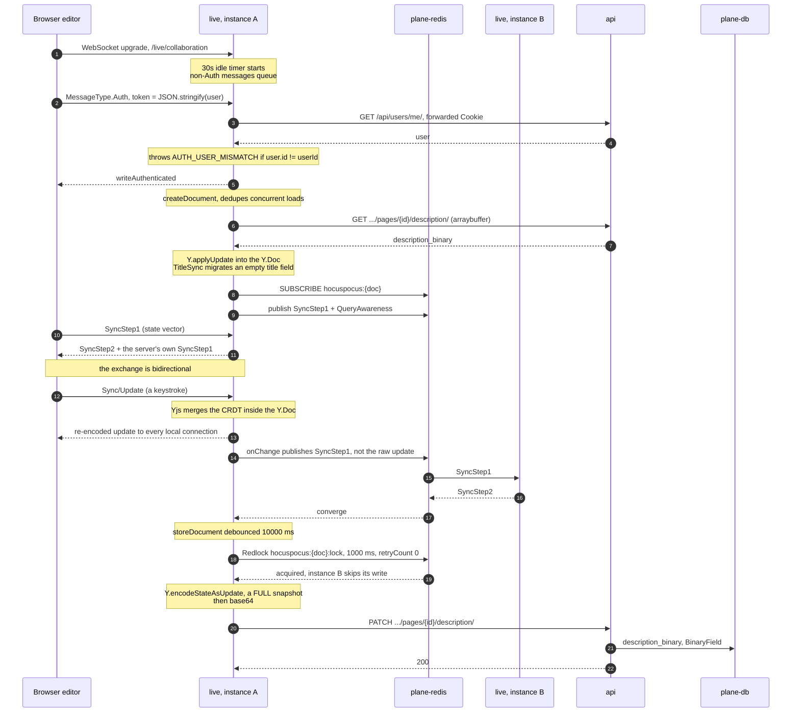

# 1. Document synchronisation

> **Last reviewed:** 2026-08-13
> **Level:** L4 Code
> **Parent component:** [4. apps/live: component map](../components/04-live-component-map.md)
> **Entry point:** `apps/live/src/controllers/collaboration.controller.ts` (`handleConnection`)
> **Re-read when:** A release touches `apps/live/src/extensions/`, `apps/live/src/hocuspocus.ts`, or the `@hocuspocus/*` catalog pin.

## 1.1 Diagram

Two `live` instances hold the same page. The path from keystroke to Postgres row crosses both, plus Redis, plus the REST API.

## 1.2 Why this page exists

All three gate statements hold.

- **Non-local**: The rule spans `apps/live/src/extensions/`, the Yjs sync protocol, the Hocuspocus hook chain, and a Redlock in `@hocuspocus/extension-redis`. No single file states it. Convergence between instances is a state-vector diff exchange, which the repo code never shows directly.
- **Expensive to get wrong**: The failure is silent document data loss. A losing Redlock holder skips its write with a log line and no error, so a wrong assumption about ordering costs user content.
- **Not already carried**: `apps/live` has tests for PDF rendering and Effect utilities only. Authentication, the extensions, the Redis fanout, and the store path have no test. An IDE call hierarchy stops at the library boundary and cannot show the Redis round trip.

The diagram names two `live` instances and three other containers, which normally makes a page L2. It stays here because the invariant depends on that crossing: rule 2 below is a distributed lock between the two instances, and a single-process diagram cannot show it. See the carve-out in [`AGENTS.md`](./AGENTS.md).

## 1.3 Symbols

Rows marked *library* live in `@hocuspocus/*` at catalog version 2.15.2, not in this repository. They carry no line reference on purpose.

| Symbol | Path | Role |
| --- | --- | --- |
| `handleConnection` | `apps/live/src/controllers/collaboration.controller.ts` | Hands the socket to Hocuspocus, closes with 1011 on error |
| `onAuthenticate` | `apps/live/src/lib/auth.ts` | Parses the token, forwards the cookie, rejects an id mismatch |
| `fetchDocument` | `apps/live/src/extensions/database.ts` | Loads the binary. Falls back to converting `description_html` when it is empty. |
| `storeDocument` | `apps/live/src/extensions/database.ts` | Converts the Yjs state and PATCHes three representations |
| `PageCoreService` | `apps/live/src/services/page/core.service.ts` | The only caller back into `apps/api` for document content |
| `TitleSyncExtension` | `apps/live/src/extensions/title-sync.ts` | Observes the `title` field, debounces a PATCH by 5000 ms |
| `forceCloseDocumentAcrossServers` | `apps/live/src/extensions/force-close-handler.ts` | Seven-step orchestrated eviction across every instance |
| `PagesDescriptionViewSet` | `apps/api/plane/app/views/page/base.py` | Serves and accepts the binary |
| `PageBinaryUpdateSerializer` | `apps/api/plane/app/serializers/page.py` | Base64-decodes and validates the payload |
| `Redis.onStoreDocument` | *library* | Takes the Redlock that elects one writer |
| `Database.store` | *library* | Calls `Y.encodeStateAsUpdate` and hands the buffer to `storeDocument` |
| `Debouncer` | *library* | Keys the pending store on `onStoreDocument-{documentName}` |

## 1.4 Rules

| # | Rule | Pinned by |
| --- | --- | --- |
| 1 | A persisted write is always a full document snapshot, never an incremental update. `Y.encodeStateAsUpdate` encodes the whole `Y.Doc`. | **No test** |
| 2 | Exactly one instance writes a given document per debounce window. The Redlock has `retryCount: 0`, so every loser skips silently. | **No test** |
| 3 | Cross-instance convergence carries state vectors, not updates. Redis publishes `SyncStep1`, and the peer answers `SyncStep2`. | **No test** |
| 4 | A server ignores its own Redis messages. Each payload is prefixed with the publishing instance identifier. | **No test** |
| 5 | Awareness is never persisted. It is fanned out over the same channel and lives only in memory. | **No test** |
| 6 | The Yjs document has exactly two named fields: `default` for the body and `title`. | **No test** |
| 7 | A store that fails with 413 must not throw. Throwing makes the Hocuspocus `finally` block touch a null document. | **No test** |

Every rule in this table is unpinned. That is the single largest risk on this page: nothing fails when one of these rules changes. Adding a test for rule 2 and rule 7 would retire most of that risk.

## 1.5 Edge cases

| Input | Naive result | Correct result | Why |
| --- | --- | --- | --- |
| A page whose `description_binary` is zero bytes | Load an empty document, then overwrite real content with blank | `fetchDocument` converts `description_html` to binary, writes it back to the API, then returns it | A page created before binary storage still holds HTML only |
| Two instances hold the document and both debounce fire | Both PATCH. The later write wins and can drop the merged state. | The Redlock elects one. The loser logs and skips. | The 10 second debounce timer is per process, not shared |
| A document that exceeds the API limit | The store throws, and the Hocuspocus `finally` block dereferences a destroyed document | `storeDocument` sets `content_too_large`, broadcasts, force-closes across servers, and returns without throwing | Documented directly in the code comment |
| A payload over 10 MB, under 4 bytes, or with script-like bytes in the first 200 | Persist it | `validate_binary_data` rejects it before the model write | Guards against a poisoned binary |
| The page is locked or archived | Persist it | The view returns 400 with `PAGE_LOCKED` or `PAGE_ARCHIVED` before the serializer runs | Lock state is authoritative on the server |
| The WebSocket is down | The user loses the edit | `usePageFallback` bypasses `live` entirely and PATCHes the API every 30 seconds, plus on a debounced Ctrl+S | Offline resilience is client-side |
| The client reconnects after a forced close | Reconnect in a loop | Close codes 4000 to 4003 pause the provider permanently until a visibility, focus, or online event | Prevents a reconnect storm after an eviction |
| A PDF is exported mid-edit | The PDF matches the screen | The PDF can be up to one debounce window stale | Export reads the last persisted binary, not the live `Y.Doc` |

## 1.6 Related

| Page | Why it matters here |
| --- | --- |
| [4. apps/live: component map](../components/04-live-component-map.md) | The container that holds this algorithm |
| [2. apps/web: component map](../components/02-web-component-map.md) | Where the provider and the IndexedDB cache live |
| [1. Container overview](../containers/01-container-overview.md) | Why `live` writes through `api` |
