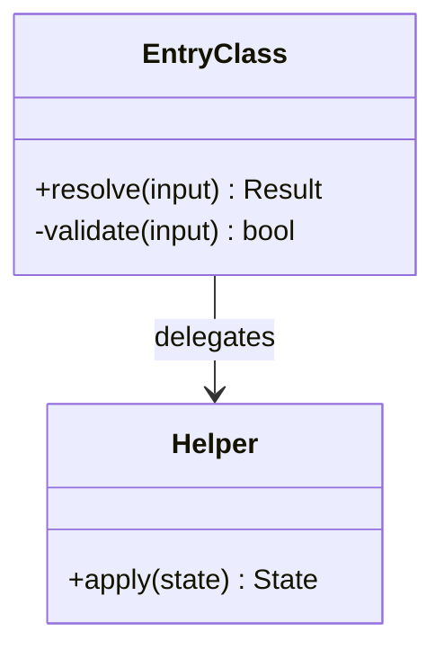
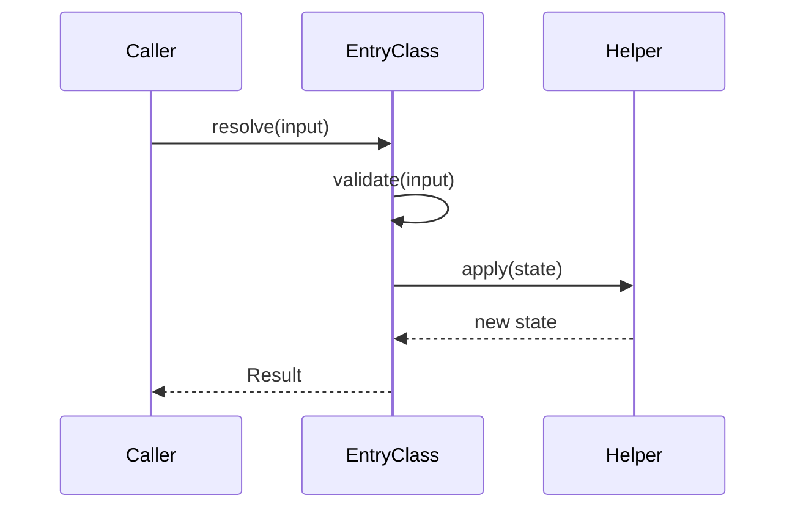

# N. <Algorithm Title>

> **Last reviewed:** YYYY-MM-DD
> **Level:** L4 Code
> **Entry point:** `<path>` (`<symbol>`)
> **Re-read when:** A release touches the entry point.

## N.1 Why this page exists

Name the statements from the bar in [`AGENTS.md`](./AGENTS.md) that apply. At least two must apply.

- **Hard to follow**: <Why a reader with the file open still cannot follow it>
- **Stable**: <When the logic last changed>
- **Expensive to get wrong**: <The concrete consequence>
- **Reasoning lives outside the code**: <The specification or protocol, with a link>

Delete a bullet that does not apply.

## N.2 Entry point

`<path>` (`<symbol>`)

One or two sentences on what the caller expects, and what the function guarantees.

| Input | Type | Meaning |
| --- | --- | --- |
| `<arg>` | `<type>` | <What it carries> |

| Output | Type | Meaning |
| --- | --- | --- |
| <return> | `<type>` | <What it guarantees> |

## N.3 Diagram

Keep the block that fits. Delete the other.

### Class relationships

### Call order

## N.4 Symbols

Every class or function in the diagram needs one row. Name a symbol, never a line number.

| Symbol | Path | Role |
| --- | --- | --- |
| `<EntryClass>` | `<path>` | <What it decides> |
| `<Helper>` | `<path>` | <What it computes> |

## N.5 Rules

The invariants this algorithm holds. Describe the rule, not the statement order.

| # | Rule | Pinned by |
| --- | --- | --- |
| 1 | <Invariant stated as a rule> | `<test path>` (`<test name>`) |
| 2 | <Invariant stated as a rule> | `<test path>` (`<test name>`) |

Every rule needs a test. A test fails when the rule changes. A page does not.

## N.6 Edge cases

The inputs that break a naive implementation.

| Input | Naive result | Correct result | Why |
| --- | --- | --- | --- |
| <Input> | <Wrong output> | <Right output> | <The rule that applies> |

## N.7 Verification

- **Tests**: `<path>`
- **Command**: `<command that runs only these tests>`
- **Expected result**: Every rule in N.5 has a passing test.

## N.8 Related

| Page | Why it matters here |
| --- | --- |
| [<L3 page>](../components/NN-slug.md) | The module that holds this algorithm |
