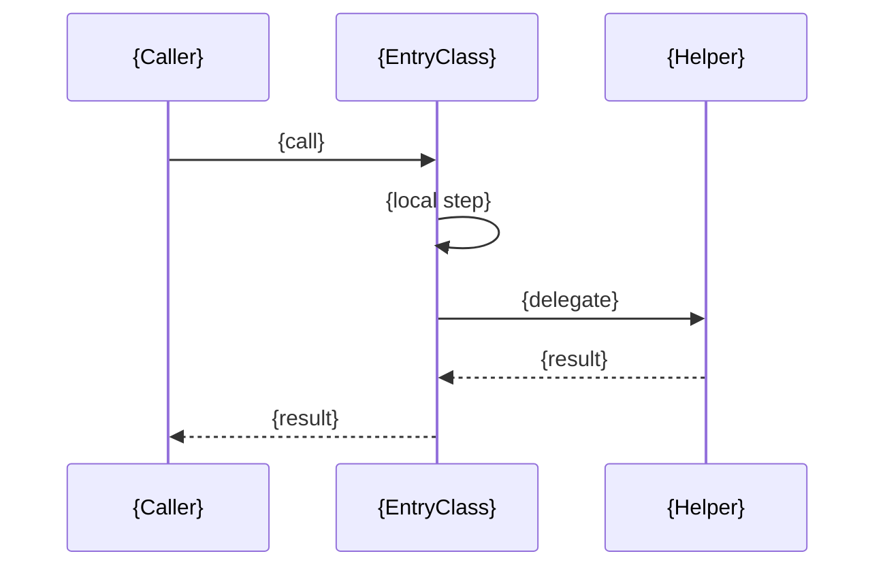
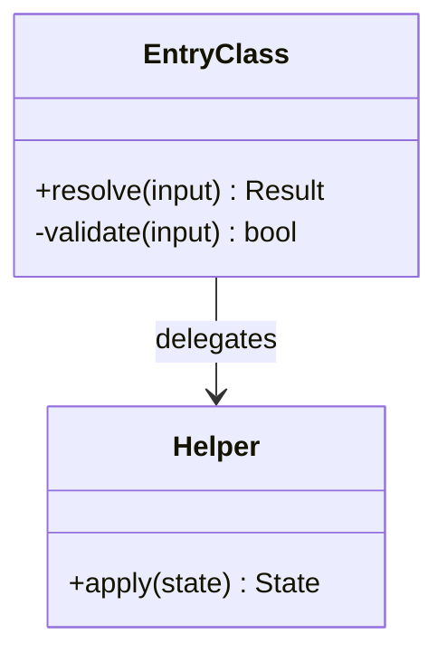

# N. {Algorithm Title}

> **Last reviewed:** YYYY-MM-DD
> **Level:** L4 Code
> **Parent component:** [{L3 page}](../components/NN-slug.md)
> **Entry point:** `{path}` (`{symbol}`)
> **Re-read when:** A release touches the entry point.

## N.1 Diagram

Keep the block that fits. Delete the other. Name a symbol, never a line number.

### Call order

### Class relationships

## N.2 Why this page exists

C4 recommends against this level. Justify the exception against the gate in [`AGENTS.md`](./AGENTS.md). All three statements must hold.

- **Non-local**: {Why the rule spans several symbols, or which external specification it comes from}
- **Expensive to get wrong**: {The concrete consequence: data loss, a security hole, or a silent wrong answer}
- **Not already carried**: {Why the code, the tests, and an IDE-generated view do not answer the question}

## N.3 Symbols

One row per class or function in the diagram.

| Symbol | Path | Role |
| --- | --- | --- |
| `{EntryClass}` | `{path}` | {What it decides} |
| `{Helper}` | `{path}` | {What it computes} |

## N.4 Rules

The invariants this algorithm holds. Describe the rule, not the statement order.

Every rule needs a test. A test fails when the rule changes. A page does not.

| # | Rule | Pinned by |
| --- | --- | --- |
| 1 | {Invariant stated as a rule} | `{test path}` (`{test name}`) |

## N.5 Edge cases

The inputs that break a naive implementation. This section carries the value of the page.

| Input | Naive result | Correct result | Why |
| --- | --- | --- | --- |
| {Input} | {Wrong output} | {Right output} | {The rule that applies} |

## N.6 Related

| Page | Why it matters here |
| --- | --- |
| [{L3 page}](../components/NN-slug.md) | The module that holds this algorithm |
