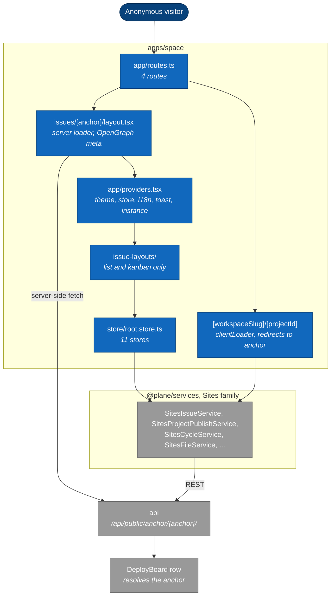

# 5. apps/space: component map

> **Last reviewed:** 2026-08-13
> **Level:** L3 Components
> **Kind:** Structural
> **Container:** `apps/space`
> **Scope:** Plane Publish. It renders a published board to an anonymous visitor. It is the only frontend that runs a server.

## 5.1 Diagram

## 5.2 Components

| Component | Path | Responsibility |
| --- | --- | --- |
| Route table | `apps/space/app/routes.ts` | 4 routes only: index, a redirect shim, the anchor layout, and a catch-all |
| Redirect shim | `apps/space/app/[workspaceSlug]/[projectId]/page.tsx` | Resolves a legacy project URL to its anchor, or redirects to `/404` |
| Anchor layout | `apps/space/app/issues/[anchor]/layout.tsx` | The one real server loader. Fetches OpenGraph metadata. |
| Providers | `apps/space/app/providers.tsx` | Theme, store, progress bar, translation, toast, instance |
| Issue layouts | `apps/space/components/issues/issue-layouts/` | List and kanban. Nothing else. |
| Stores | `apps/space/store/root.store.ts` | 11 stores, including `PublishListStore` |

## 5.3 State

**`RootStore`** (`apps/space/store/root.store.ts`)

| Store | Owns |
| --- | --- |
| `PublishStore` | The board toggles. Exposes `canComment`, `canReact`, `canVote`. |
| `IssueStore`, `IssueDetailStore`, `IssueFilterStore` | The published work items and the active filter |
| `StateStore`, `LabelStore`, `MemberStore`, `CycleStore`, `ModuleStore` | Lookup data for the board |
| `InstanceStore`, `UserStore` | Instance readiness, and the optional signed-in user |

## 5.4 The anchor model

`apps/space` never sends a workspace slug. Every path is `/api/public/anchor/{anchor}/...`.

The API resolves the anchor to a `DeployBoard` row, reads `entity_identifier` off it, and returns 404 with "Project is not published" when no row matches. Authorization is therefore possession of the anchor, not membership.

Anonymous capability is narrower than it looks:

| Action | Anonymous visitor |
| --- | --- |
| Read the board, work items, cycles, modules, labels, states | Yes |
| Read comments | Yes |
| Write a comment | No. Needs a Plane account. |
| Read or write a reaction or a vote | No. Those viewsets are `IsAuthenticated` for every method. |
| Read an asset | Yes. Writing needs an account. |

Only `IssueCommentPublicViewSet` switches permission by method. `IssueReactionPublicViewSet`, `CommentReactionPublicViewSet`, and `IssueVotePublicViewSet` declare none, so they inherit `IsAuthenticated` from `BaseViewSet` for reads as well.

## 5.5 How space differs from web

| Aspect | `apps/web` | `apps/space` |
| --- | --- | --- |
| Rendering | `ssr: false`, static files behind nginx | `ssr: true`, `react-router-serve` on Node 22 |
| Container runtime | nginx 1.31 | Node 22 |
| API prefix | `/api/` | `/api/public/` |
| Addressing | Workspace slug and project ID | Opaque `anchor` |
| Auth endpoints | `/auth/*` | `/auth/spaces/*`, a separate family |
| Layouts | List, kanban, calendar, spreadsheet, gantt | List and kanban only |
| Stores | 30 | 11 |

## 5.6 Notes

- **SSR buys real security headers.** `root.tsx` exports a `headers` function that sets `Referrer-Policy`, `X-Content-Type-Options`, and HSTS. `apps/web` and `apps/admin` cannot do this, because they ship as static files. The document also sets `robots: noindex, nofollow`.
- **The app hides affordances inside an iframe.** `useIsInIframe` removes the comment box and the reactions when the board is embedded.
- **A published page has no route.** `TPublishEntityType` allows `project` and `page`, but the app handles `project` only and redirects everything else to `/404`.
- **The public intake API has no UI here.** The API exposes `IntakeIssuePublicViewSet` and the app declares a `TIntakeIssueForm` type, but no component imports it.

### `apps/space/nginx/nginx.conf` is dead

The file exists and `Dockerfile.space` never copies it. It is residue from the build before SSR. The container runs `react-router-serve`, not nginx.

## 5.7 Related

| Page | Why it matters here |
| --- | --- |
| [1. apps/api: module map](./01-api-module-map.md) | `plane/space/`, the surface this app calls |
| [1. System context](../context/01-system-context.md) | The anonymous visitor actor |
| [1. Container overview](../containers/01-container-overview.md) | Why this container runs Node and the others run nginx |
