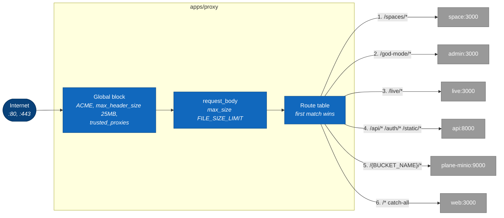

# 6. apps/proxy: component map

> **Last reviewed:** 2026-08-13
> **Level:** L3 Components
> **Kind:** Structural
> **Container:** `apps/proxy`
> **Scope:** The Caddy edge. It is the only container that publishes a host port, so every public request starts here.

The whole container is one `Caddyfile` and one custom Caddy build. It has no application code, so this page is short by design.

## 6.1 Diagram

Caddy takes the first matching route. Order is the behaviour, so the diagram is ordered top to bottom.

## 6.2 Components

| Component | Path | Responsibility |
| --- | --- | --- |
| Route table | `apps/proxy/Caddyfile.ce`, snippet `plane_proxy` | Six route groups, evaluated in file order |
| Global block | `apps/proxy/Caddyfile.ce` | ACME issuance, header size, client IP resolution |
| Body guard | `apps/proxy/Caddyfile.ce` | `request_body max_size`, applied before routing |
| All-in-one table | `apps/proxy/Caddyfile.aio.ce` | The same prefixes against `localhost` ports, for the single-image deployment |
| Custom build | `apps/proxy/Dockerfile.ce` | `xcaddy` build on Caddy 2.11.3 with the Cloudflare and DigitalOcean DNS plugins, plus `caddy-l4` |

## 6.3 Route table

| Order | Match | Upstream | Note |
| --- | --- | --- | --- |
| 1 | `/spaces/*` | `space:3000` | `/spaces` redirects to `/spaces/` first |
| 2 | `/god-mode/*` | `admin:3000` | `/god-mode` redirects to `/god-mode/` first |
| 3 | `/live/*` | `live:3000` | Carries the WebSocket upgrade |
| 4 | `/api/*`, `/auth/*`, `/static/*` | `api:8000` | Three separate directives |
| 5 | `/{BUCKET_NAME}/*` | `plane-minio:9000` | `BUCKET_NAME` defaults to `uploads` |
| 6 | `/*` | `web:3000` | The catch-all |

The prefix is never stripped. `admin` and `space` must therefore serve from a matching subdirectory, which is why their base path is baked in at image build time.

## 6.4 Configuration

| Variable | Default | Effect |
| --- | --- | --- |
| `SITE_ADDRESS` | no default | The site block address. Drives automatic TLS. |
| `FILE_SIZE_LIMIT` | `5242880` | Rejects a larger body before it reaches `api` |
| `BUCKET_NAME` | `uploads` | The path prefix routed to MinIO |
| `TRUSTED_PROXIES` | `0.0.0.0/0` | Which upstream may set the client IP header |
| `CERT_EMAIL` | no default | ACME account address |
| `CERT_ACME_CA` | Let's Encrypt production | The ACME directory |
| `CERT_ACME_DNS` | no default | DNS-01 provider credentials |

## 6.5 Notes

- **The body limit lives in three places and they must agree.** Caddy caps the request body, Django sets `DATA_UPLOAD_MAX_MEMORY_SIZE`, and the API sets its own `FILE_SIZE_LIMIT`. A mismatch turns a clear 413 into a confusing failure further in.
- **`TRUSTED_PROXIES` defaults to `0.0.0.0/0`.** Every source is trusted to set `X-Forwarded-For` and `X-Real-IP`. Any per-IP rate limit downstream is therefore spoofable unless you narrow this to your real ingress.
- **Object storage is internet-reachable.** Route 5 proxies the bucket prefix straight to `plane-minio:9000`, so MinIO is exposed under `/{BUCKET_NAME}/` whenever `USE_MINIO` is on.
- **The all-in-one image uses different ports.** `Caddyfile.aio.ce` maps `/spaces/*` to `localhost:3002`, `/live/*` to `localhost:3005`, and `/api/*` to `localhost:3004`, and serves `web` and `admin` as static files. Do not read the Compose ports into that topology.

This container holds no MobX store and no application state. It is configuration and one binary.

## 6.6 Related

| Page | Why it matters here |
| --- | --- |
| [1. Container overview](../containers/01-container-overview.md) | Every upstream this table names |
| [2. Request lifecycle](../containers/02-request-lifecycle.md) | What happens after Caddy hands the request to `api` |
| [../../../devops/infra/INDEX.md](../../../devops/infra/INDEX.md) | TLS and certificate operations |
