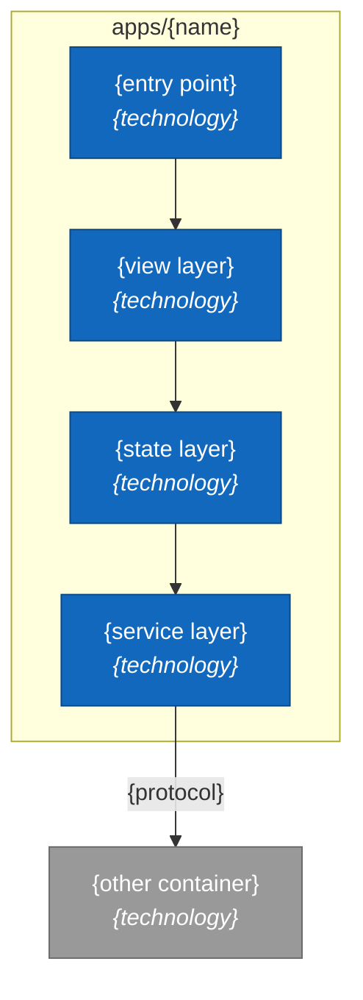
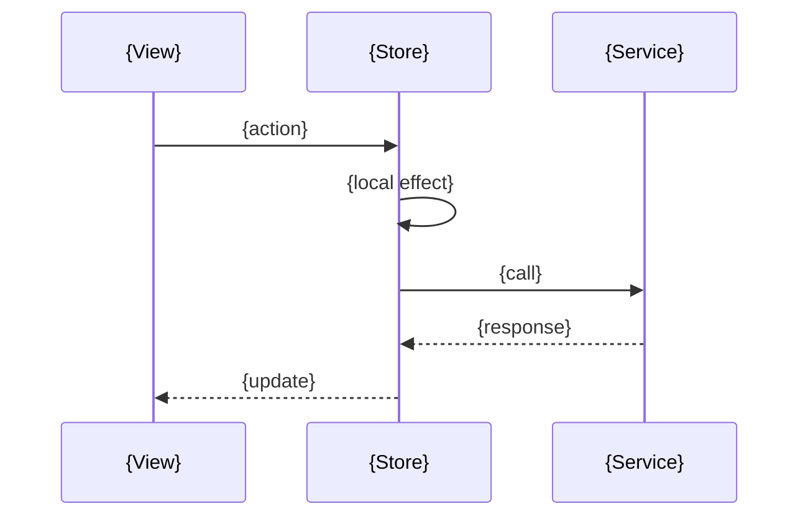

# N. {Container}: {Map or Journey Title}

> **Last reviewed:** YYYY-MM-DD
> **Level:** L3 Components
> **Kind:** Structural | Dynamic
> **Container:** `apps/{name}`
> **Scope:** One sentence that states what this container is responsible for.

Every element on this page must share one process with the others. If one does not, the page is L2. See [`AGENTS.md`](./AGENTS.md).

## N.1 Diagram

Keep the block that matches the page kind. Delete the other.

### Structural

Put every component inside one `subgraph` for the container. Draw the containers it talks to outside that boundary, and mark them `ext`.

### Dynamic

Every participant must share one process. A participant in another process makes this an L2 page.

## N.2 Components

One row per node in the diagram. This table saves the reader a code search, so it is the highest-value section on the page. Give every row a real path.

| Component | Path | Responsibility |
| --- | --- | --- |
| {Name as the diagram labels it} | `apps/{name}/...` | {What it owns} |

## N.3 State

Delete this section on a container that holds no store. Say why, rather than leaving an empty table.

**`{StoreName}`** (`apps/{name}/core/store/...`)

| Observable | Type | Purpose |
| --- | --- | --- |
| `{name}` | `{type}` | {What it holds, and who reads it} |

| Action | Effect |
| --- | --- |
| `{actionName}` | {What it changes, and which service it calls} |

## N.4 Notes

Three bullets at most. Write what the picture cannot show.

- **Primary path**: The route through the diagram that carries the most traffic.
- **Constraint**: A rule the code enforces, named with the symbol that enforces it.
- **Design choice**: Something a reader cannot guess from the code.

Repo rules to respect when a note touches them:

- Name the Canvas, Surface, or Layer choice for a UI component. See `packages/tailwind-config/AGENTS.md`.
- Name the translation key from `packages/i18n/src/locales`, never the English text.
- Name the DRF permission class that guards an endpoint.

## N.5 Related

| Page | Why it matters here |
| --- | --- |
| [{L2 page}](../containers/NN-slug.md) | The flow that crosses into this container |
| [{L4 page}](../code/NN-slug.md) | Call detail for one hard function here |
| [{Security page}](../../../security/NN-slug.md) | The restriction enforced here |

### Related feature specs

Delete this table when no spec drove a change to this page.

| Spec | Description | Status |
| --- | --- | --- |
| [{Feature name}](../../../features/new/{slug}.md) | One-line summary | {A status from `docs/features/AGENTS.md`} |
