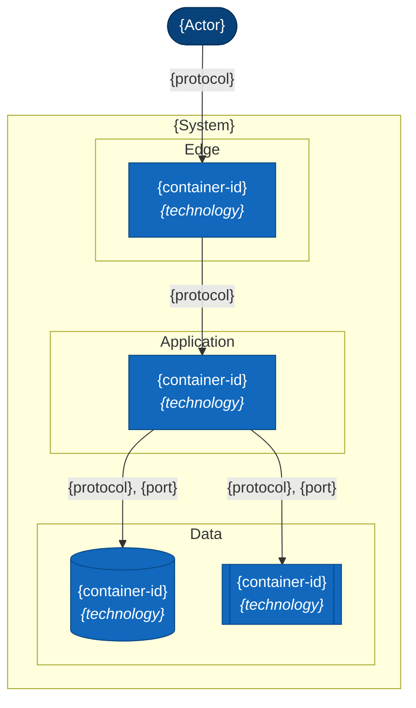
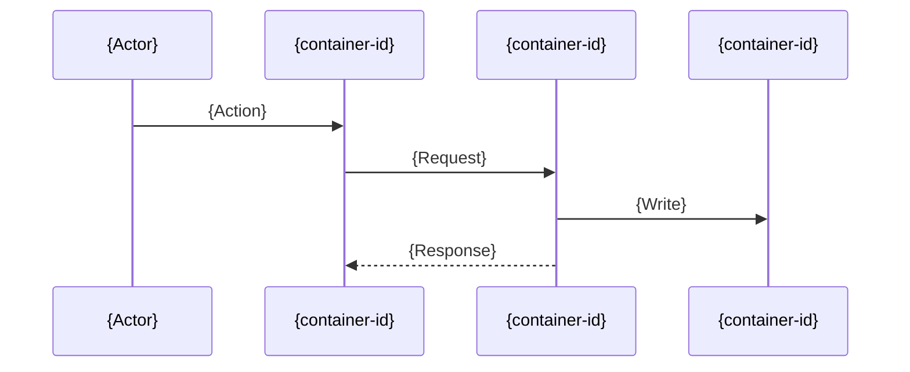
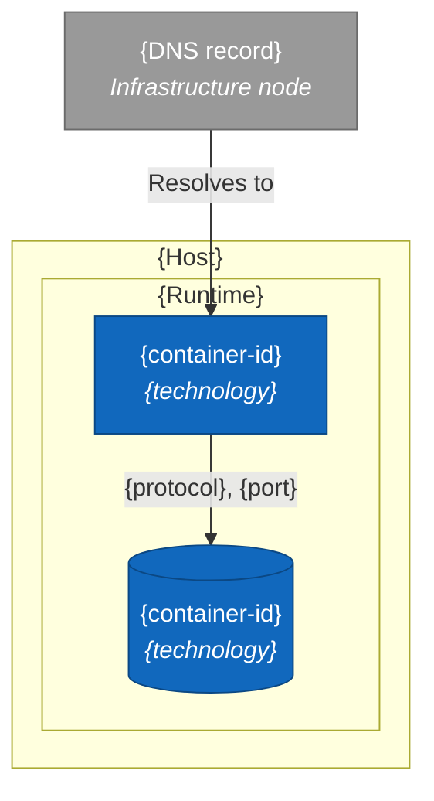

# N. {Title}

> **Last reviewed:** YYYY-MM-DD
> **Level:** L2 Containers
> **Kind:** Structural | Dynamic | Deployment
> **Deployment environment:** {Deployment pages only. One environment. Delete otherwise.}
> **Scope:** One sentence. For a dynamic page, state where the flow starts and where it ends.

Read every value on this page from its source file. This template carries no repository facts on purpose, because a copied pin goes stale.

## N.1 Diagram

Keep the block that matches the page kind. Delete the others.

### Structural

Nest a `subgraph` per trust zone, so the picture carries the boundary.

### Dynamic

### Deployment

Scope this diagram to one deployment environment. Nest a `subgraph` per deployment node.

## N.2 Elements

Title this section `Participants` on a dynamic page. Add a `Node` column on a deployment page.

| Container | Technology | Responsibility | Exposure | Compose service |
| --- | --- | --- | --- | --- |
| `{container-id}` | {technology} | {What it is responsible for} | Public / Internal / Internal only | yes |
| `{client-side container}` | {technology} | {What it is responsible for} | Client device | no |

Name the source of every pin. Name the source of any container that has no Compose service.

State what this list leaves out. A container list built only from Compose is incomplete.

## N.3 Relationships

Structural and deployment pages only. Delete on a dynamic page, because the diagram already carries the order.

| From | To | Protocol | Port | Carries |
| --- | --- | --- | --- | --- |
| `{container-id}` | `{container-id}` | {protocol} | {port} | {What flows} |

## N.4 Trust boundaries

Structural and deployment pages only. Delete on a dynamic page.

| Zone | Contains | Exposure |
| --- | --- | --- |
| {Zone} | {Containers} | {Exposure} |

## N.5 Failure modes

Dynamic pages only. This section carries the value of the page, so never leave it empty.

| Failure | Observable symptom | Recovery |
| --- | --- | --- |
| {What breaks} | {What a user or an operator sees} | [{SOP name}](../../../sops/{slug}-sop.md) |

## N.6 Notes

Three bullets at most. Write what the picture cannot show.

- **Primary path**: The route through the diagram when every step succeeds.
- **Branch**: The main decision point, and both outcomes.
- **Design choice**: Something a reader cannot guess from the code.

Name an environment variable here only when it changes the shape of the diagram. The canonical lists are [`.env.example`](../../../../.env.example) and [`apps/api/.env.example`](../../../../apps/api/.env.example). Operational depth for a deployment target lives in [`../../../devops/infra/`](../../../devops/infra/INDEX.md). Link to it and never copy it.

## N.7 Related

| Page | Why it matters here |
| --- | --- |
| [{L1 page}](../context/NN-slug.md) | The external boundary around these containers |
| [{L3 page}](../components/NN-slug.md) | File-level detail inside one container |
| [{Infra page}](../../../devops/infra/NN-slug.md) | How these containers deploy |

### Related feature specs

Delete this table when no spec drove a change to this page.

| Spec | Description | Status |
| --- | --- | --- |
| [{Feature name}](../../../features/new/{slug}.md) | One-line summary | {A status from `docs/features/AGENTS.md`} |
