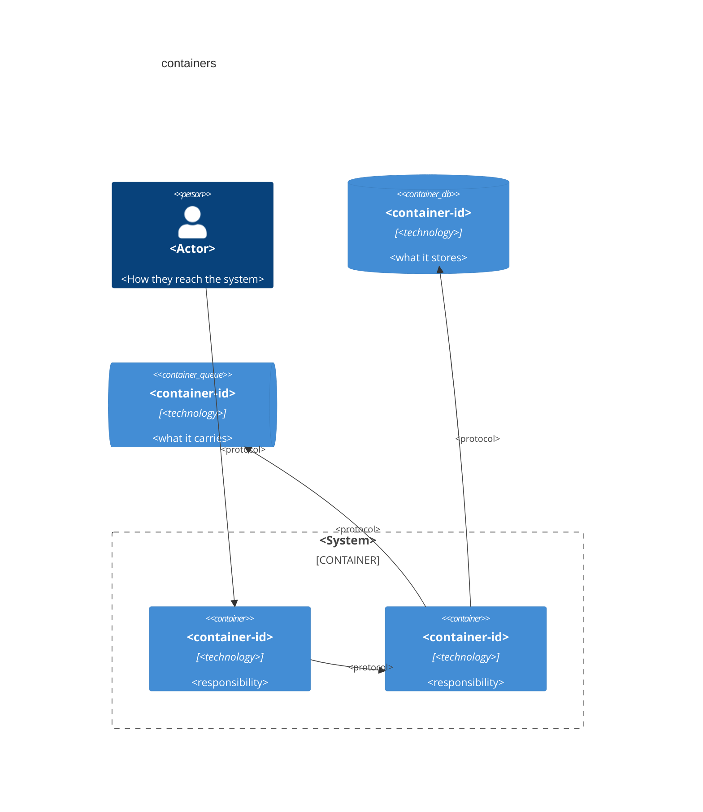
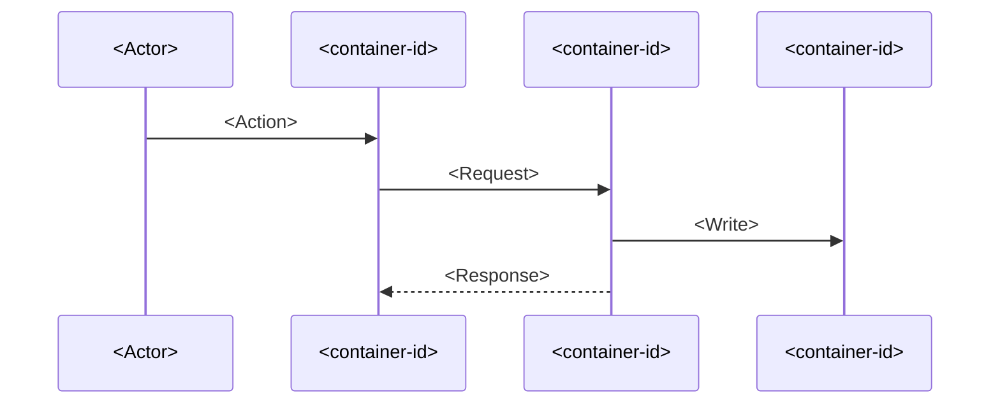
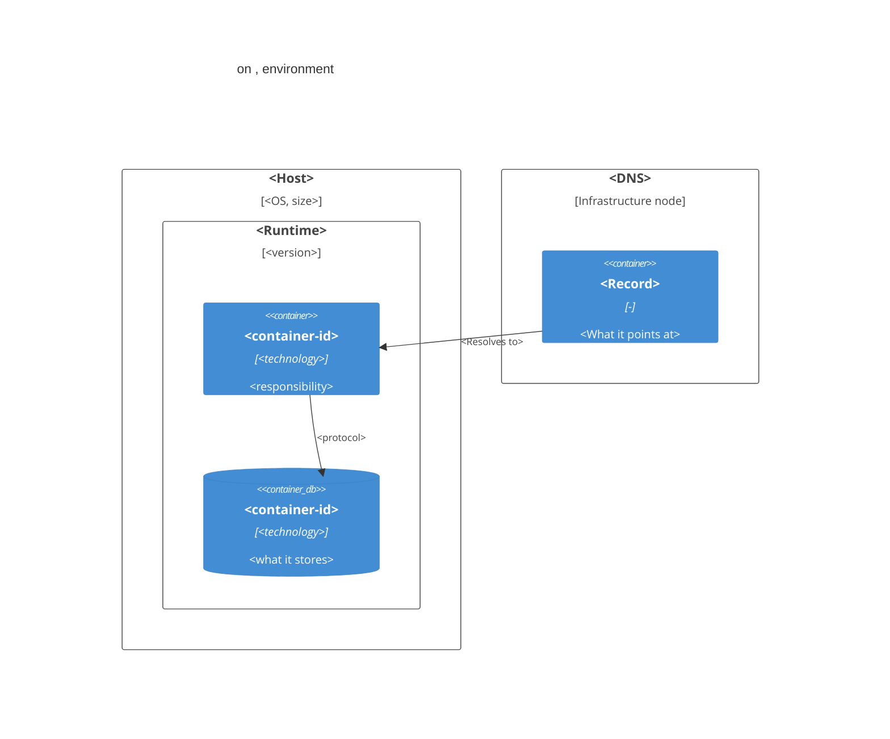

# N. <Title>

> **Last reviewed:** YYYY-MM-DD
> **Level:** L2 Containers
> **Kind:** Structural | Dynamic | Deployment
> **Deployment environment:** <Deployment pages only. One environment. Delete otherwise.>
> **Scope:** One sentence. For a dynamic page, state where the flow starts and where it ends.

Read every value below from its source file. This template carries no repository facts on purpose, because a copied pin goes stale.

## Which sections this page needs

| Section | Structural | Dynamic | Deployment |
| --- | --- | --- | --- |
| N.1 Diagram | Yes | Yes | Yes |
| N.2 Elements | Yes | As `Participants` | As nodes and instances |
| N.3 Relationships | Yes | Delete | Yes |
| N.4 Trust boundaries | Yes | Delete | Yes |
| N.5 Deployment nodes | Delete | Delete | Yes |
| N.6 Failure modes | Delete | Yes, never empty | Delete |
| N.7 Configuration | Delete | Yes | Delete |
| N.8 Notes | Yes | Yes | Yes |
| N.9 Verification | Yes | Yes | Yes |

### Related feature specs

| Spec | Description | Status |
| --- | --- | --- |
| [<Feature name>](../../../features/new/<slug>.md) | One-line summary | <A status from `docs/features/AGENTS.md`> |

## N.1 Diagram

Keep the block that matches the page kind. Delete the others.

### Structural

### Dynamic

### Deployment

Scope this diagram to one deployment environment.

## N.2 Elements

On a dynamic page, title this section `Participants`. On a deployment page, add a `Node` column.

| Container | Technology | Responsibility | Exposure | Compose service |
| --- | --- | --- | --- | --- |
| `<container-id>` | <technology> | <What it is responsible for> | <Public, Internal, or Internal only> | yes |
| `<client-side container>` | <technology> | <What it is responsible for> | Client device | no |

Name the source of the pins, and the source of any container that has no Compose service. [`AGENTS.md`](./AGENTS.md) gives the rules for building this list.

State what this list leaves out. A container list built only from Compose is incomplete.

## N.3 Relationships

| From | To | Protocol | Port | Carries |
| --- | --- | --- | --- | --- |
| `<container-id>` | `<container-id>` | <protocol> | <port> | <What flows> |

## N.4 Trust boundaries

| Zone | Contains | Exposure |
| --- | --- | --- |
| <Zone> | <Containers> | <Exposure> |

## N.5 Deployment nodes

| Node | Type | Nested in | Holds | Instances |
| --- | --- | --- | --- | --- |
| <Node> | Deployment node | <Parent, or -> | <Containers> | <count> |
| <Node> | Infrastructure node | <Parent, or -> | - | - |

Operational depth for this target lives in [`../../../devops/infra/`](../../../devops/infra/INDEX.md). Do not duplicate it. Link to it.

## N.6 Failure modes

Never leave this table empty on a dynamic page.

| Failure | Observable symptom | Recovery |
| --- | --- | --- |
| <What breaks> | <What a user or an operator sees> | [<SOP name>](../../../sops/<slug>-sop.md) |

## N.7 Configuration

| Variable | Default | Effect |
| --- | --- | --- |
| `<ENV_VAR>` | `<default>` or `no default` | <What changes when you set it> |

Canonical list: [`.env.example`](../../../../.env.example) and [`apps/api/.env.example`](../../../../apps/api/.env.example).

## N.8 Notes

- **Primary path**: The route through the diagram when every step succeeds.
- **Branch**: The main decision point and both outcomes.
- **Design choice**: Something a reader cannot guess from the code.

## N.9 Verification

- **Tests**: `<test path>`
- **Command**: <The exact command that exercises this flow or starts these containers>
- **Expected result**: <The observable proof>

## N.10 Related

| Page | Why it matters here |
| --- | --- |
| [<L1 page>](../context/NN-slug.md) | The external boundary around these containers |
| [<L3 page>](../components/NN-slug.md) | File-level detail inside one container |
| [<Infra page>](../../../devops/infra/NN-slug.md) | How these containers deploy |
| [<Security page>](../../../security/NN-slug.md) | The restriction enforced here |
