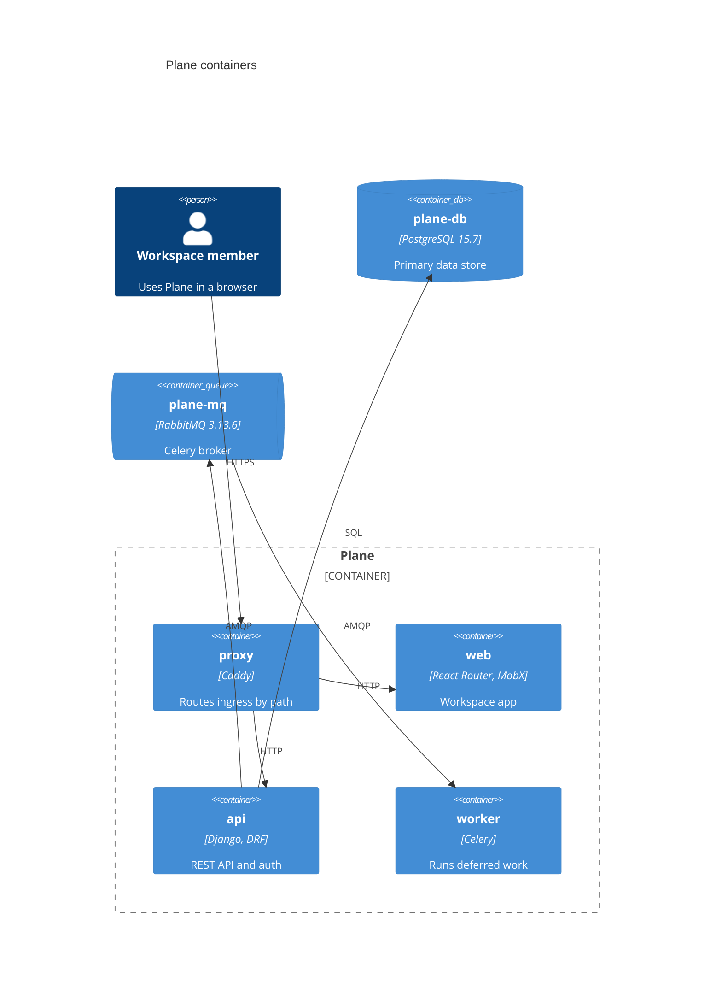
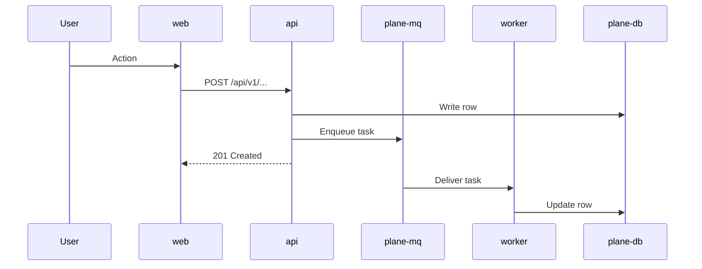

# N. <Title>

> **Last reviewed:** YYYY-MM-DD
> **Level:** L2 Containers
> **Kind:** Structural | Dynamic
> **Scope:** One sentence. For a dynamic page, state where the flow starts and where it ends.

### Related feature specs

| Spec | Description | Status |
| --- | --- | --- |
| [<Feature name>](../../../features/new/<slug>.md) | One-line summary | Shipped / Partial / Draft |

## N.1 Diagram

Keep the block that matches the page kind. Delete the other.

### Structural

### Dynamic

## N.2 Elements

On a dynamic page, title this section `Participants`.

| Container | Technology | Responsibility | Exposure |
| --- | --- | --- | --- |
| `proxy` | Caddy | Terminates TLS and routes ingress by path | Public |
| `api` | Django, DRF | Serves REST endpoints and authentication | Internal |
| `plane-db` | PostgreSQL 15.7 | Stores workspaces, projects, and work items | Internal only |

Source of these pins: `docker-compose.yml`.

## N.3 Relationships

Structural pages only. Delete on a dynamic page.

| From | To | Protocol | Port | Carries |
| --- | --- | --- | --- | --- |
| `proxy` | `api` | HTTP | 8000 | REST requests |
| `api` | `plane-db` | TCP | 5432 | SQL queries |
| `api` | `plane-mq` | AMQP | 5672 | Task messages |

## N.4 Trust boundaries

Structural pages only. Delete on a dynamic page.

| Zone | Contains | Exposure |
| --- | --- | --- |
| Internet | <Nodes> | Public |
| Edge | `proxy` | Public ingress |
| Application | <Nodes> | Internal |
| Data | <Nodes> | Internal only |

## N.5 Failure modes

Dynamic pages only. Delete on a structural page. This section is mandatory on a dynamic page.

| Failure | Observable symptom | Recovery |
| --- | --- | --- |
| <Broker unreachable> | <Task never runs, no error in the UI> | [<SOP name>](../../../sops/<slug>-sop.md) |
| <Migration not applied> | <500 on first request to the endpoint> | <Steps or SOP link> |

## N.6 Configuration

Dynamic pages only. Delete on a structural page.

| Variable | Default | Effect |
| --- | --- | --- |
| `<ENV_VAR>` | `<default>` or `no default` | What changes when you set it |

Canonical list: [`.env.example`](../../../../.env.example) and [`apps/api/.env.example`](../../../../apps/api/.env.example).

## N.7 Notes

- **Primary path**: The route through the diagram when every step succeeds.
- **Branch**: The main decision point and both outcomes.
- **Design choice**: Something a reader cannot guess from the code.

## N.8 Verification

- **Tests**: `apps/api/tests/...`
- **Command**: The exact command that exercises this flow or starts these containers.
- **Expected result**: The observable proof.

## N.9 Related

| Page | Why it matters here |
| --- | --- |
| [<L1 page>](../context/NN-slug.md) | The external boundary around these containers |
| [<L3 page>](../components/NN-slug.md) | File-level detail inside one container |
| [<Infra page>](../../../devops/infra/NN-slug.md) | How these containers deploy |
| [<Security page>](../../../security/NN-slug.md) | The restriction enforced here |
