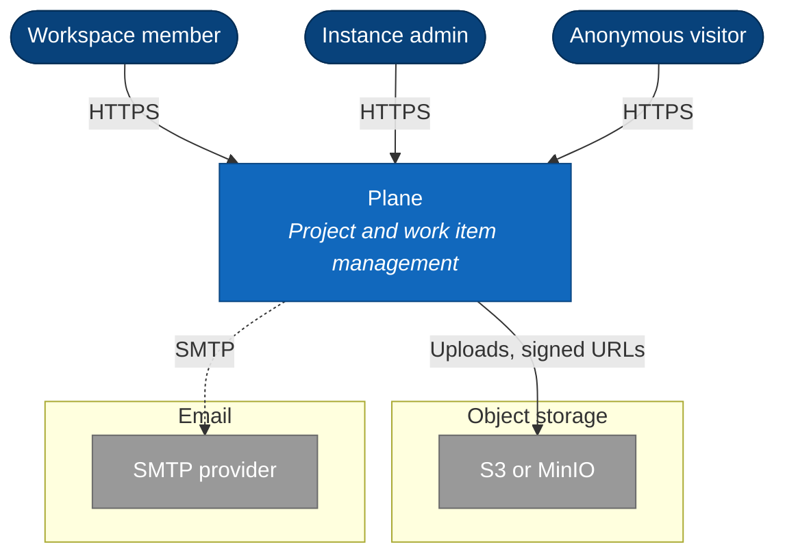

# N. {Title}

> **Last reviewed:** YYYY-MM-DD
> **Level:** L1 Context
> **Scope:** One sentence that states the boundary of this page.

## N.1 Diagram

Group the external systems by purpose. Draw an optional integration with a dashed arrow.

## N.2 Actors

| Actor | Reaches | Does |
| --- | --- | --- |
| {Role, as the product names it} | {Surface} | {What they do} |

Add an anonymous actor wherever a surface accepts unauthenticated traffic.

## N.3 External systems

Every row needs a `Data sent` value and an `Availability` value.

| System | Purpose | Data sent | Required | Availability | Enabled by |
| --- | --- | --- | --- | --- | --- |
| {Provider} | {Why Plane calls it} | {Data category} | yes / no | Cloud / Self-hosted / Both / Commercial | `{ENV_VAR}` |

Cite the source that proves each row, for example `apps/api/plane/settings/common.py` or `docker-compose.yml`.

## N.4 Notes

Three bullets at most. Write what the picture cannot show.

- **Primary path**: The route through the diagram that carries the most traffic.
- **Boundary**: The line a reader must respect.
- **Design choice**: Something a reader cannot guess.

## N.5 Related

| Page | Why it matters here |
| --- | --- |
| [{L2 page}](../containers/NN-slug.md) | The units inside the Plane box |
| [{Security page}](../../../security/NN-slug.md) | The control on each boundary |

### Related feature specs

Delete this table when no spec drove a change to this page.

| Spec | Description | Status |
| --- | --- | --- |
| [{Feature name}](../../../features/new/{slug}.md) | One-line summary | {A status from `docs/features/AGENTS.md`} |
