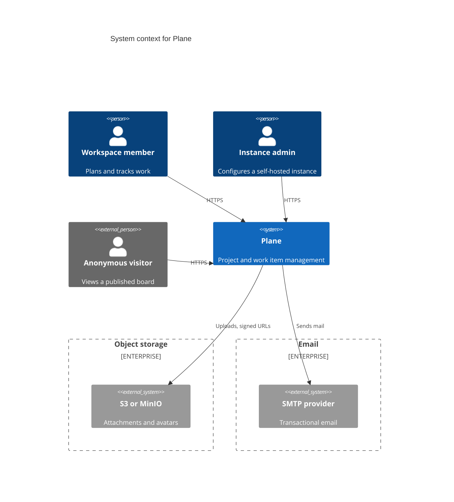

# N. <Title>

> **Last reviewed:** YYYY-MM-DD
> **Level:** L1 Context
> **Scope:** One sentence that states the boundary of this page.

### Related feature specs

| Spec | Description | Status |
| --- | --- | --- |
| [<Feature name>](../../../features/new/<slug>.md) | One-line summary | Shipped / Partial / Draft |

## N.1 Diagram

## N.2 Actors

| Actor | Reaches | Does |
| --- | --- | --- |
| Workspace member | <Surface> | <What they do> |
| Workspace admin | <Surface> | <What they do> |
| Instance admin | <Surface> | <What they do> |
| Anonymous visitor | <Surface> | <What they do> |

Link each surface to [`../../../clients/INDEX.md`](../../../clients/INDEX.md).

## N.3 External systems

Every row needs a `Data sent` value and an `Availability` value.

| System | Purpose | Data sent | Required | Availability | Enabled by |
| --- | --- | --- | --- | --- | --- |
| <Provider> | <Why Plane calls it> | <Data category> | yes / no | Cloud / Self-hosted / Both / Commercial | `<ENV_VAR>` |

Cite the source that proves each row, for example `apps/api/plane/settings/common.py` or `docker-compose.yml`.

## N.4 Trust boundaries

| Zone | Contains | Exposure |
| --- | --- | --- |
| Internet | <Actors and external systems> | Public |
| Plane | The system as one box | Mixed |

## N.5 Notes

- **Summary point 1**: The primary path through the diagram.
- **Summary point 2**: The main boundary a reader must respect.
- **Summary point 3**: A design choice a reader cannot guess.

## N.6 Related

| Page | Why it matters here |
| --- | --- |
| [<L2 page>](../containers/NN-slug.md) | The units inside the Plane box |
| [<Client page>](../../../clients/NN-slug.md) | The surface each actor reaches |
| [<Security page>](../../../security/NN-slug.md) | The control on each boundary |
