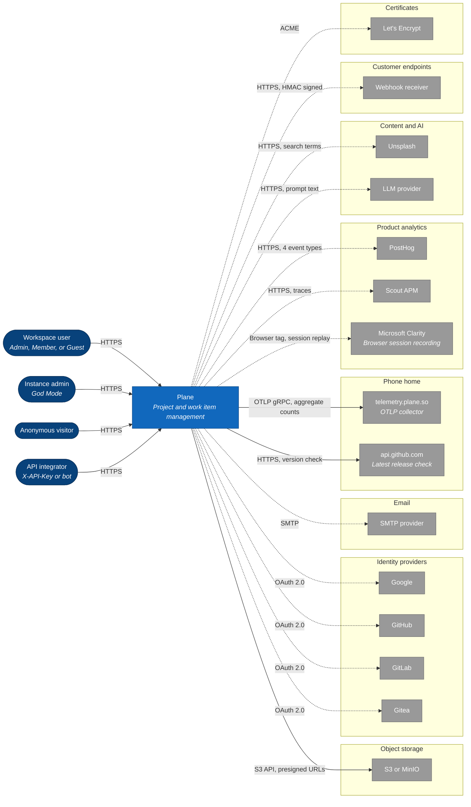

# 1. System context

> **Last reviewed:** 2026-08-13
> **Level:** L1 Context
> **Scope:** Plane as one box. Who reaches it, and every external system it calls. This repository builds the Community Edition, so every integration below is one that Community Edition source proves.

## 1.1 Diagram

A solid arrow is a call that always happens. A dashed arrow is optional, and a self-hosted instance can run without it.

## 1.2 Actors

| Actor | Reaches | Does | Proven by |
| --- | --- | --- | --- |
| Workspace Admin (role 20) | Web app | Administers a workspace, deletes it, manages members and tokens | `apps/api/plane/db/models/workspace.py:19` |
| Workspace Member (role 15) | Web app | Creates projects, plans and tracks work | `apps/api/plane/app/permissions/project.py:25-31` |
| Workspace Guest (role 5) | Web app | Reads and contributes inside the projects they join | `apps/api/plane/db/models/project.py:100` |
| Instance admin | Admin app, God Mode | Configures one self-hosted instance: auth providers, SMTP, AI, workspace policy | `apps/api/plane/license/models/instance.py:52-69` |
| Anonymous visitor | Space app, published boards | Reads a published board, page, or intake form | `apps/api/plane/space/views/project.py:20` |
| API integrator | REST API, `/api/v1/` | Automates Plane with a personal access token or a bot account | `apps/api/plane/api/middleware/api_authentication.py:17-49` |

Three rules that the picture cannot show:

- A new workspace or project member defaults to **Guest**, not Member.
- A Workspace Admin reaches any project endpoint in a project they belong to, even where their project role is lower.
- An anonymous visitor can read a published board, but cannot comment, react, or vote. Each of those needs a Plane account.

## 1.3 External systems

Every row is proven by Community Edition source. `Enabled by` names the variable that switches the integration on.

This table carries no `Availability` column on purpose. This repository builds the Community Edition only, so it cannot prove which edition an integration reaches. Appendix C carries the edition model, which comes from the product documentation rather than from code.

| System | Purpose | Data sent | Required | Enabled by |
| --- | --- | --- | --- | --- |
| S3 or MinIO | Attachments, avatars, exports | User files, work item attachments, generated exports | **yes** | `USE_MINIO`, `AWS_S3_ENDPOINT_URL` |
| `api.github.com` | Resolves the latest Plane release on every API boot | Nothing. It is a read. | **yes, no opt-out** | none |
| `telemetry.plane.so` | Instance usage telemetry | Aggregate counts, instance ID, version, edition, domain. No work item content. | opt-out | `OTLP_ENDPOINT`, DB flag `is_telemetry_enabled` |
| SMTP provider | Transactional email | Login codes, reset tokens, invitations, notification digests | no | `ENABLE_SMTP` |
| Google | OAuth sign-in | Email address, basic profile | no | `IS_GOOGLE_ENABLED` |
| GitHub | OAuth sign-in, optional org gate | Email address, basic profile, org membership | no | `IS_GITHUB_ENABLED` |
| GitLab | OAuth sign-in. `GITLAB_HOST` allows a self-hosted GitLab. | Email address, basic profile | no | `IS_GITLAB_ENABLED` |
| Gitea | OAuth sign-in | Email address, basic profile | no | `IS_GITEA_ENABLED` |
| PostHog | Product analytics | Four event types only: workspace created, workspace deleted, user joined, user invited | no | `POSTHOG_API_KEY` and `POSTHOG_HOST` |
| Scout APM | Application performance monitoring, production settings only | Request traces | no | `SCOUT_MONITOR`, `SCOUT_KEY` |
| Microsoft Clarity | Session recording. The browser calls it directly, not the server. | Session replay of the web app | no | `VITE_ENABLE_SESSION_RECORDER` and `VITE_SESSION_RECORDER_KEY` |
| Unsplash | Cover image search | User search terms | no | `UNSPLASH_ACCESS_KEY` |
| LLM provider | AI text endpoints | User task text and prompt | no | `LLM_API_KEY` |
| Webhook receiver | Outbound events to a customer URL | Work item, project, cycle, module, and comment events | no | Per workspace, in the UI |
| Let's Encrypt | ACME certificate issuance at the proxy | Domain name | no | `CERT_EMAIL`, `CERT_ACME_CA` |

Sources: `apps/api/plane/settings/common.py`, `apps/api/plane/utils/instance_config_variables/core.py`, `apps/api/plane/authentication/provider/oauth/`, `apps/web/app/root.tsx`, `apps/proxy/Caddyfile.ce`.

Two more external systems apply at install time rather than at run time, so the diagram leaves them out. `deployments/cli/community/install.sh` pulls release artifacts from GitHub Releases and container images from Docker Hub under the `makeplane` organization.

### What this repository does not contain

Do not add these to the diagram. The product documentation describes them, and no Community Edition source proves them.

| Absent | Evidence |
| --- | --- |
| Sentry error monitoring | No `sentry_sdk` in `requirements/`, no `@sentry/*` dependency, nothing in `settings/production.py`. `packages/i18n` does ship translated `sentry_integration` copy in all 19 locales, for a product-level integration with no Community Edition backend. |
| Prime, licensing, payment | `InstanceEdition` holds one value, `PLANE_COMMUNITY` |
| SAML, OIDC, LDAP | Only four OAuth provider modules exist |
| Slack, GitHub App | The web UI builds the OAuth URLs, but no backend route serves them |
| Importers, the silo service | Legacy tables survive with no URL route |

## 1.4 Trust boundaries

| Zone | Contains | Exposure |
| --- | --- | --- |
| Internet | Every actor, and every external system in the table above | Public |
| Plane | The system as one box | Mixed. One public ingress, everything else internal. |

Naming the units inside the box is L2 work. [1. Container overview](../l2-containers/01-container-overview.md) carries the four-zone table with a row per container.

## 1.5 Notes

- **Object storage is not optional.** `STORAGES["default"]` is always `S3Storage`, and no filesystem fallback exists. An instance with no bucket cannot accept an upload.
- **Two calls leave the instance whatever you configure.** The release check has no opt-out. Telemetry is opt-out rather than opt-in, because `is_telemetry_enabled` defaults to true.
- **`GET /api/instances/` is `AllowAny`.** It returns the enabled auth providers, `posthog_api_key`, `slack_client_id`, and the file size limit to any unauthenticated caller.

## 1.6 Related

| Page | Why it matters here |
| --- | --- |
| [2. Container overview](../l2-containers/01-container-overview.md) | The units inside the Plane box |
| [../../../devops/infra/INDEX.md](../../../devops/infra/INDEX.md) | How those units deploy, per target |
| [../../../security/INDEX.md](../../../security/INDEX.md) | The control on each boundary |

## Appendix A. Delivery surfaces

Product-level facts, verified against `docs.plane.so` and `developers.plane.so` on 2026-08-13. This repository builds only the rows marked "This repo".

| Surface | Kind | Where it lives | Availability |
| --- | --- | --- | --- |
| Web app | Browser SPA | This repo, `apps/web` | Every edition |
| God Mode | Browser SPA | This repo, `apps/admin` | Self-hosted |
| Plane Publish | Browser SPA | This repo, `apps/space` | Every edition |
| Desktop app | Electron | Outside this repo | Cloud, and Commercial v3.0.0 or later |
| Mobile app | iOS, Android | Outside this repo | Cloud, and Commercial v1.12.0 or later. Not Community. |
| MCP server | Separate MIT repo | `makeplane/plane-mcp-server` | Cloud, and self-hosted |

Desktop builds: macOS Universal 2.0.0, Linux AppImage 2.0.0, Windows x64 1.6.1. The Windows tile on the download page now reads "Coming soon", and Windows comes from a separate build lineage, which is why it sits a major version behind.

Mobile minimums are iOS 14 and Android 10. Push notification is Cloud only.

## Appendix B. Programmatic interfaces

| Interface | Path | Authentication |
| --- | --- | --- |
| REST API v1 | `/api/v1/` | `X-API-Key` only. `APIKeyAuthentication` reads no bearer token, so the OAuth path the product documentation describes has no Community Edition code. |
| Internal app API | `/api/` | Session cookie |
| Public API | `/api/public/` | Anonymous, for published boards |
| Instance API | `/api/instances/` | Anonymous to read, instance admin to write |
| Authentication | `/auth/` | Credentials, magic code, or OAuth |
| Webhooks | Your own URL | HMAC in `X-Plane-Signature` |

Rate limits read from `apps/api/plane/settings/common.py` and `apps/api/plane/authentication/rate_limit.py`:

| Scope | Limit |
| --- | --- |
| API key | 60 per minute |
| Anonymous | 30 per minute |
| Authentication endpoints, per IP | 10 per minute |
| Asset ID | 5 per minute |

Pagination is cursor-based. The cursor is `value:offset:is_prev`. `per_page` defaults to 100, and the server caps it at 100.

The MCP server exposes more than 100 tools across 20 modules, over four transports: HTTP with OAuth, HTTP with a personal access token, local stdio, and legacy SSE.

## Appendix C. Editions and deployment

Two independent axes. Do not conflate them.

**Edition, by deployment:**

| Edition | Hosted by | License |
| --- | --- | --- |
| Cloud | Plane | Commercial |
| Community | You | AGPL v3.0. This repository. |
| Commercial | You | Closed source. Full Cloud parity, 12 free seats. |
| Airgapped | You | Closed source. Commercial for isolated networks. |

**Plan tier:** Free, Pro, Business, and Enterprise Grid. A tier applies to Cloud and to a self-hosted commercial instance. Community Edition matches the Free tier and takes no license key.

Documented self-host methods: Docker Compose, Docker AIO, Docker Swarm, Kubernetes, FIPS, Podman Quadlets, Airgapped on Docker, Airgapped on Kubernetes, Coolify, and Portainer.
