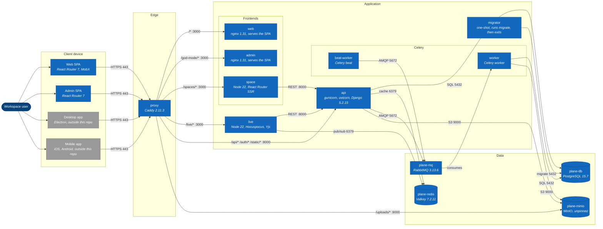

# 1. Container overview

> **Last reviewed:** 2026-08-13
> **Level:** L2 Containers
> **Kind:** Structural
> **Scope:** Every container that must run for Plane to work, and the traffic between them. Read from `docker-compose.yml` and `apps/proxy/Caddyfile.ce`.

## 1.1 Diagram

## 1.2 Elements

`docker-compose.yml` holds 13 services and 4 named volumes. That file is not the container list, because a C4 container is any application or data store that must run. The four client-side rows below have no Compose service.

| Container | Technology | Responsibility | Internal port | Compose service |
| --- | --- | --- | --- | --- |
| `proxy` | Caddy 2.11.3 | Terminates TLS, routes every public path | 80, 443 | yes |
| `web` | nginx 1.31 | Serves the built Web SPA as static files | 3000 | yes |
| `admin` | nginx 1.31 | Serves the built Admin SPA as static files | 3000 | yes |
| `space` | Node 22, React Router | Renders published boards on the server | 3000 | yes |
| `api` | Django 5.2.15, DRF 3.17.1, gunicorn with uvicorn workers | Every REST endpoint, auth, and the admin API | 8000 | yes |
| `worker` | Celery 5.5.3 | Runs every background task | - | yes |
| `beat-worker` | Celery beat | Enqueues 12 scheduled tasks | - | yes |
| `migrator` | Django | Runs `migrate`, then exits | - | yes |
| `live` | Node 22, Hocuspocus, Yjs | Real-time document collaboration | 3000 | yes |
| `plane-db` | PostgreSQL 15.7-alpine | Every relational record. `max_connections=1000`. | 5432 | yes |
| `plane-redis` | Valkey 7.2.11-alpine | Django cache, and pub/sub for `live` | 6379 | yes |
| `plane-mq` | RabbitMQ 3.13.6 | The Celery broker | 5672 | yes |
| `plane-minio` | MinIO, **no version tag** | S3-compatible object storage | 9000, 9090 | yes |
| Web SPA | React Router 7, MobX | The product UI. Runs in the browser. | - | no |
| Admin SPA | React Router 7 | God Mode UI. Runs in the browser. | - | no |
| Desktop app | Electron | Outside this repository | - | no |
| Mobile app | iOS, Android | Outside this repository | - | no |

The Web SPA and the Admin SPA are separate containers from `web` and `admin`. Both frontends set `ssr: false`, so `web` and `admin` run nginx and serve static files, and no Node process runs in either. The application executes on the client device. `space` is the only frontend with `ssr: true`.

## 1.3 Relationships

| From | To | Protocol | Port | Carries |
| --- | --- | --- | --- | --- |
| Browser, desktop, mobile | `proxy` | HTTPS | 443 | Every request |
| `proxy` | `web` | HTTP | 3000 | `/*`, the catch-all |
| `proxy` | `admin` | HTTP | 3000 | `/god-mode/*` |
| `proxy` | `space` | HTTP | 3000 | `/spaces/*` |
| `proxy` | `live` | HTTP, WebSocket | 3000 | `/live/*` |
| `proxy` | `api` | HTTP | 8000 | `/api/*`, `/auth/*`, `/static/*` |
| `proxy` | `plane-minio` | HTTP | 9000 | `/{BUCKET_NAME}/*` |
| `space` | `api` | REST | 8000 | Server-side render data |
| `live` | `api` | REST | 8000 | Document load and persistence |
| `api` | `plane-db` | SQL | 5432 | Every read and write |
| `api` | `plane-redis` | RESP | 6379 | Cache and session |
| `api` | `plane-mq` | AMQP | 5672 | Task enqueue |
| `api` | `plane-minio` | S3 | 9000 | Uploads and presigned URLs |
| `beat-worker` | `plane-mq` | AMQP | 5672 | Scheduled task enqueue |
| `plane-mq` | `worker` | AMQP | 5672 | Task delivery |
| `worker` | `plane-db`, `plane-minio` | SQL, S3 | 5432, 9000 | Task side effects |
| `migrator` | `plane-db` | SQL | 5432 | Schema migration |
| `live` | `plane-redis` | RESP | 6379 | Cross-instance document broadcast |

Route order in `Caddyfile.ce` is `/spaces`, `/god-mode`, `/live`, `/api`, `/auth`, `/static`, the bucket, then the `/*` catch-all. Order matters, because Caddy takes the first match.

## 1.4 Trust boundaries

| Zone | Contains | Exposure |
| --- | --- | --- |
| Client device | Web SPA, Admin SPA, desktop app, mobile app | Untrusted |
| Edge | `proxy` | The only container that publishes a host port |
| Application | `web`, `admin`, `space`, `api`, `worker`, `beat-worker`, `migrator`, `live` | Internal network only |
| Data | `plane-db`, `plane-redis`, `plane-mq`, `plane-minio` | Internal network only |

`proxy` is the only service in `docker-compose.yml` with a `ports:` block. It maps `${LISTEN_HTTP_PORT}:80` and `${LISTEN_HTTPS_PORT}:443`, which default to 80 and 443.

`docker-compose-local.yml` is the developer stack and breaks that boundary on purpose. It holds 8 services, no frontend and no proxy, and publishes `plane-db` 5432, `plane-redis` 6379, `plane-minio` 9000 and 9090, and `api` 8000 straight to the host. Run the frontends on the host with `pnpm dev`.

## 1.5 Notes

- **Startup order is enforced in code, not by Compose.** `api`, `worker`, and `beat-worker` each run `wait_for_migrations`, which polls every 10 seconds until no migration is pending. That is the gate that sequences them behind `migrator`, which runs `migrate` and exits.
- **Celery has one queue.** No `CELERY_TASK_ROUTES`, no `task_queues`, and no `-Q` flag on either worker. Every one of the 47 tasks runs on the default `celery` queue, so one slow task type delays every other.
- **`live` never writes to Postgres.** It persists a document by calling the REST API over HTTP, on a 10 second debounce. A `live` outage therefore loses at most the last debounce window, and never corrupts the database directly.
- **`plane-minio` carries no version tag.** Every other image is pinned. `docker-compose.yml` uses bare `minio/minio`, so two installs a month apart can run different builds.

### Two defects this diagram exposes

Both are recorded because a reader would otherwise assume the opposite.

| Defect | Evidence |
| --- | --- |
| The `live` service cannot start from the root `docker-compose.yml`. It declares no `env_file` and no `environment`, but `apps/live/src/env.ts` requires `API_BASE_URL` and `LIVE_SERVER_SECRET_KEY` and calls `process.exit(1)` when validation fails. The released stack at `deployments/cli/community/docker-compose.yml` does supply both. | `docker-compose.yml:99-106`, `apps/live/src/env.ts` |
| No `live` endpoint is authenticated. `requireSecretKey` exists in `apps/live/src/lib/auth-middleware.ts`, but no controller applies it, and the one API caller sends no header. Do not read the `live` to `api` arrow as an authenticated channel. | `apps/live/src/lib/auth-middleware.ts`, `apps/api/plane/bgtasks/copy_s3_object.py` |

## 1.6 Related

| Page | Why it matters here |
| --- | --- |
| [1. System context](../l1-context/01-system-context.md) | The external boundary around these containers |
| [2. Request lifecycle](./02-request-lifecycle.md) | How one request travels across them |
| [../../../devops/infra/INDEX.md](../../../devops/infra/INDEX.md) | The image pin and the volume for each service |
| [../../../sops/local-development-setup-sop.md](../../../sops/local-development-setup-sop.md) | How to start this stack locally |
