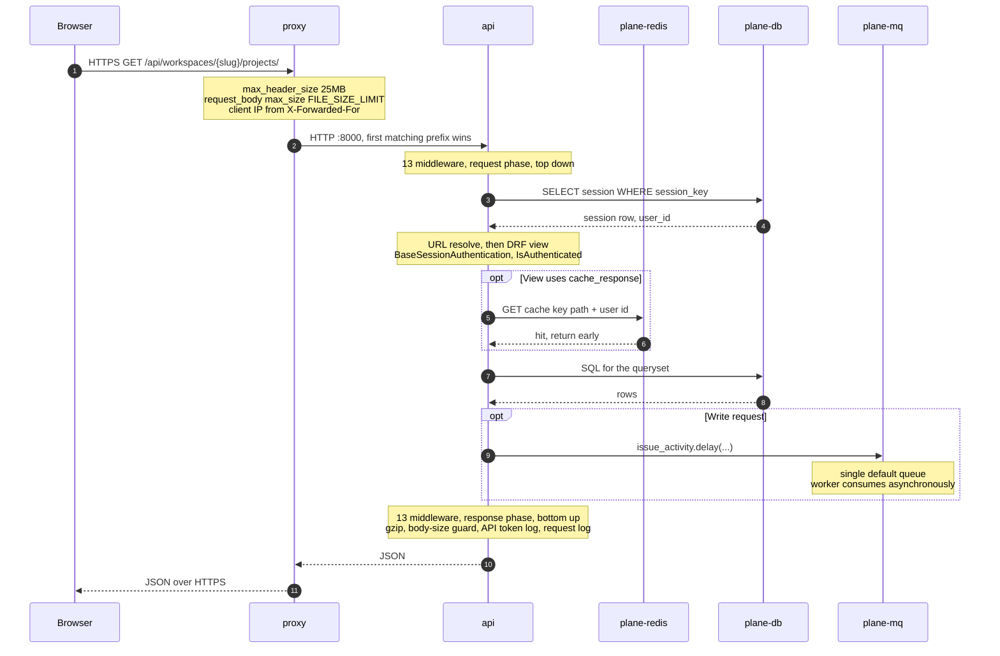

# 2. Request lifecycle

> **Last reviewed:** 2026-08-13
> **Level:** L2 Containers
> **Kind:** Dynamic
> **Scope:** One authenticated HTTP request, from the browser to `plane-db` and back. Starts at the TLS handshake on `proxy`. Ends at the JSON response.

## 2.1 Diagram

## 2.2 Participants

| Container | Role in this flow |
| --- | --- |
| Browser | Holds the session cookie and issues the request |
| `proxy` | Terminates TLS, caps the body and header size, routes by path prefix |
| `api` | Runs the middleware chain, resolves the URL, authorizes, and queries |
| `plane-redis` | Serves a cached response body where the view opts in |
| `plane-db` | Holds both the session row and the application data |
| `plane-mq` | Accepts the task a write request enqueues |

## 2.3 The middleware chain

The request phase runs top down. The response phase runs bottom up. Order is exact, read from `apps/api/plane/settings/common.py:121-135`.

| # | Middleware | Does |
| --- | --- | --- |
| 1 | `corsheaders.CorsMiddleware` | Applies the CORS allowlist |
| 2 | `django.middleware.security.SecurityMiddleware` | Security headers |
| 3 | `whitenoise.WhiteNoiseMiddleware` | Serves collected static files |
| 4 | `plane.authentication.middleware.session.SessionMiddleware` | Picks the session cookie by path |
| 5 | `django.middleware.common.CommonMiddleware` | URL normalization |
| 6 | `django.middleware.csrf.CsrfViewMiddleware` | CSRF, but see the note below |
| 7 | `django.contrib.auth.middleware.AuthenticationMiddleware` | Attaches `request.user` |
| 8 | `django.middleware.clickjacking.XFrameOptionsMiddleware` | `X-Frame-Options` |
| 9 | `crum.CurrentRequestUserMiddleware` | Thread-local current user |
| 10 | `django.middleware.gzip.GZipMiddleware` | Compresses the response |
| 11 | `plane.middleware.request_body_size.RequestBodySizeLimitMiddleware` | Turns `RequestDataTooBig` into a JSON 413 |
| 12 | `plane.middleware.logger.APITokenLogMiddleware` | Logs API-key calls, enqueues `process_logs` |
| 13 | `plane.middleware.logger.RequestLoggerMiddleware` | Emits `plane.api.request`, skips `GET /` |

A 14th, `plane.middleware.db_routing.ReadReplicaRoutingMiddleware`, is appended only when `ENABLE_READ_REPLICA=1`.

## 2.4 Authentication by URL prefix

`plane/urls.py` mounts six prefixes. Each one authenticates differently, and that is the single most useful fact on this page.

| Prefix | Module | Authentication | Default permission |
| --- | --- | --- | --- |
| `/api/` | `plane.app.urls` | `BaseSessionAuthentication` | `IsAuthenticated` |
| `/api/public/` | `plane.space.urls` | `BaseSessionAuthentication` | `IsAuthenticated`, widely overridden to `AllowAny` |
| `/api/instances/` | `plane.license.urls` | `BaseSessionAuthentication` | `InstanceAdminPermission` |
| `/api/v1/` | `plane.api.urls` | `APIKeyAuthentication`, `X-API-Key` | `IsAuthenticated`, throttled 60 per minute |
| `/auth/` | `plane.authentication.urls` | None. Plain `django.views.View`. | None |
| `/` | `plane.web.urls` | None | `robots.txt` and the health check |

## 2.5 Failure modes

| Failure | Observable symptom | Recovery |
| --- | --- | --- |
| `proxy` down | Connection refused on every path. No port is published without it. | Restart `proxy`. It is the only ingress. |
| `api` down | 502 on `/api/*`, `/auth/*`, `/static/*`. The web shell still loads from `web`, then every data fetch fails. `admin` and `space` break too, because their data also crosses `/api`. | [local-development-setup-sop.md](../../../sops/local-development-setup-sop.md) |
| `plane-db` down at boot | `api` never reaches gunicorn. `wait_for_db` runs first under `set -e`. | Start `plane-db` first, then `api`. |
| `plane-db` down at runtime | HTTP 500 `{"error": "Something went wrong please try again later"}` from `BaseAPIView.handle_exception`. Every user is effectively logged out, because sessions are rows in `plane-db`. | Restore `plane-db`. Sessions survive, because they are persisted. |
| `plane-redis` down | Magic-code login fails, because the code lives in Valkey. Every DRF throttle fails, because `AnonRateThrottle` is a global default. Cached reads fall through to `plane-db`. | Restart `plane-redis`. No data loss. |
| `plane-mq` down | The request still succeeds. The activity feed, notifications, and email silently stop, because `.delay()` cannot reach the broker. | Restart `plane-mq`. Enqueued work is lost, not replayed. |
| `migrator` still running | `api`, `worker`, and `beat-worker` block in `wait_for_migrations`, polling every 10 seconds. This looks like a hang. | Wait. Watch `plane-migrator` logs. |

## 2.6 Notes

- **Sessions live in Postgres, not Redis.** `SESSION_ENGINE` is `plane.db.models.session` and the table is `sessions`. The session key is 128 characters, not Django's default 32. A Postgres outage therefore signs everyone out, and a Valkey outage does not.
- **CSRF is not enforced on DRF endpoints.** `CsrfViewMiddleware` sits at position 6, but `BaseSessionAuthentication.enforce_csrf` is an empty override, so every session-authenticated API call skips the check. Read `apps/api/plane/authentication/session.py`.
- **The admin session cookie is selected by a substring match.** `SessionMiddleware` uses `admin-session-id` whenever the literal string `instances` appears anywhere in `request.path`, and `session-id` otherwise. Any future path containing that substring changes which cookie applies.
- **`/auth/` never returns a JSON error.** Every failure is a 302 that carries error parameters in the query string, because those endpoints are plain Django views.

## 2.7 Related

| Page | Why it matters here |
| --- | --- |
| [1. Container overview](./01-container-overview.md) | The containers this flow crosses |
| [1. System context](../l1-context/01-system-context.md) | The rate limits on each prefix |
| [../l3-components/INDEX.md](../l3-components/INDEX.md) | What happens inside `api` once the view runs |
