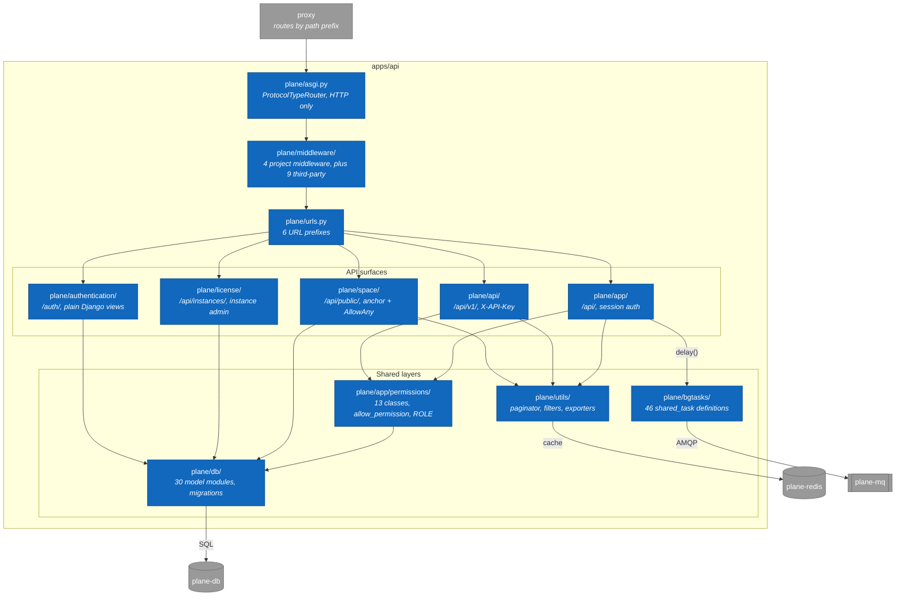

# 1. apps/api: module map

> **Last reviewed:** 2026-08-13
> **Level:** L3 Components
> **Kind:** Structural
> **Container:** `apps/api`
> **Scope:** Every Python package inside the `api` container, and how a request reaches one. Celery task code lives here. Celery task execution does not, because `worker` is a separate process.

## 1.1 Diagram

Four API surfaces run in parallel. They differ in authentication and in serializer set. They share one model layer and one permission layer. That split is the most important thing on this page.

## 1.2 Components

| Component | Path | Responsibility |
| --- | --- | --- |
| ASGI entry | `plane/asgi.py` | `ProtocolTypeRouter` with an `http` key only. No WebSocket protocol is registered. |
| Middleware | `plane/middleware/` | Request logging, API-token logging, body-size limit. Read-replica routing when enabled. |
| URL router | `plane/urls.py` | Mounts the six prefixes and sets `handler404` |
| Internal API | `plane/app/` | The surface the first-party SPAs call. 19 domain subpackages under `views/`. |
| Public REST API | `plane/api/` | Version 1. Its serializers support `?fields=` and `?expand=`. |
| Public space API | `plane/space/` | Published boards. Keyed by an opaque `anchor`, not a workspace slug. |
| Instance API | `plane/license/` | Instance registration, God Mode configuration, telemetry push |
| Authentication | `plane/authentication/` | Four OAuth providers, email and magic-code credentials, session middleware |
| Permissions | `plane/app/permissions/` | 7 workspace classes, 5 project classes, 1 page class, plus `allow_permission` and `ROLE` |
| Models | `plane/db/` | 30 model modules, the migrations, and 17 management commands |
| Background tasks | `plane/bgtasks/` | 46 active `@shared_task` definitions across 32 modules. One more lives in `plane/license/bgtasks/`, for 47 in total. |
| Shared library | `plane/utils/` | Paginators, issue filters, exporters, the OpenAPI hooks |
| Throttles | `plane/throttles/` | One module. `AssetRateThrottle`, applied to one view. |
| Health and robots | `plane/web/` | `GET /` returns `{"status": "OK"}`. `GET /robots.txt` disallows everything. |

This table is the complete package list. The diagram draws the request path only, and leaves out `plane/throttles/` and `plane/web/` to stay under 20 nodes.

## 1.3 How the four surfaces differ

| Surface | Prefix | Authentication | Authorization | Serializers |
| --- | --- | --- | --- | --- |
| `plane/app/` | `/api/` | `BaseSessionAuthentication` | `allow_permission` decorator, per method | `plane/app/serializers/` |
| `plane/api/` | `/api/v1/` | `APIKeyAuthentication` | Imports the same classes from `plane.app.permissions` | `plane/api/serializers/` |
| `plane/space/` | `/api/public/` | Session, but overridden | `DeployBoard` lookup by `anchor` | `plane/space/serializer/` |
| `plane/license/` | `/api/instances/` | Session, admin cookie | `InstanceAdminPermission` | Inline |

`/api/v1/` and `/api/` share one role model. They differ only in how the caller proves identity and in which serializer set renders the response.

`plane/space/` authorizes differently from every other surface. It never checks membership. It resolves the `anchor` to a `DeployBoard` row, reads `entity_identifier` off it, and returns 404 when no row matches.

## 1.4 The domain model

Every model extends `BaseModel`, a UUID-primary-key model that combines time audit, user audit, and soft delete. `save()` fills `created_by` and `updated_by` from `crum.get_current_user()`.

Two abstract bases set the scope:

| Base | Holds | Used by |
| --- | --- | --- |
| `ProjectBaseModel` | FK to `Project` and to `Workspace` | `Cycle`, `Module`, `Issue`, `State`, `Intake` |
| `WorkspaceBaseModel` | FK to `Workspace`, optional `Project` | `Label`, `IssueView`, `DeployBoard`, `DraftIssue` |

`Page` extends neither. It is workspace-scoped, and it joins to projects through `ProjectPage`, so one page can belong to zero or many projects.

## 1.5 Notes

- **The runtime is ASGI, but nothing uses the async capability.** The entrypoint runs gunicorn with `uvicorn.workers.UvicornWorker` against `plane.asgi:application`. The router registers `http` only, so `apps/live` handles every WebSocket. `plane/wsgi.py` exists and no entrypoint references it.
- **There are two permission packages.** `plane/app/permissions/` is canonical. `plane/utils/permissions/` is a near-duplicate that omits `WorkspaceMemberPermission` and skips a workspace-membership check in the `allow_permission` creator path. Three modules still import the duplicate: `plane/api/views/invite.py`, `plane/api/views/member.py`, and `plane/api/serializers/member.py`. Prefer the canonical one, and treat the difference as a bug rather than a design.
- **`plane/analytics/` is an empty Django app.** It holds `__init__.py` and `apps.py` and nothing else, while the analytics endpoints live in `plane/app/views/analytic/`. `plane/app/middleware/api_authentication.py` is a byte-for-byte duplicate of the v1 class with zero importers.
- **OpenAPI covers `/api/v1/` only.** `ENABLE_DRF_SPECTACULAR` defaults to `0`, and `SCHEMA_PATH_PREFIX` is `/api/v1/`, so the schema never describes the internal API.

## 1.6 Related

| Page | Why it matters here |
| --- | --- |
| [2. Request lifecycle](../l2-containers/02-request-lifecycle.md) | The middleware order and the per-prefix auth model |
| [1. Container overview](../l2-containers/01-container-overview.md) | Where `worker` executes the tasks defined here |
| [../../../security/INDEX.md](../../../security/INDEX.md) | The role model these permission classes enforce |
