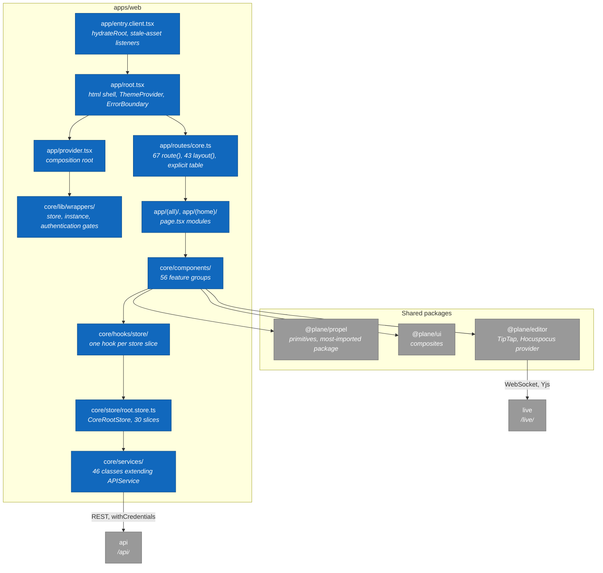

# 2. apps/web: component map

> **Last reviewed:** 2026-08-13
> **Level:** L3 Components
> **Kind:** Structural
> **Container:** `apps/web`
> **Scope:** The client-side Web SPA. Every component here runs in the browser, because `react-router.config.ts` sets `ssr: false`.

## 2.1 Diagram

## 2.2 Components

| Component | Path | Responsibility |
| --- | --- | --- |
| Client entry | `apps/web/app/entry.client.tsx` | Hydrates the document. Registers three stale-asset listeners in production. |
| Root module | `apps/web/app/root.tsx` | The `html` shell, five themes, the error boundary, the Clarity tag |
| Route table | `apps/web/app/routes/core.ts` | 67 `route()` calls and 43 `layout()` calls. The single source of URLs. |
| Composition root | `apps/web/app/provider.tsx` | Nests store, i18n, toast, and SWR providers |
| Bootstrap wrappers | `apps/web/core/lib/wrappers/` | Theme sync, instance readiness, authentication and onboarding gate |
| Pages | `apps/web/app/(all)/`, `apps/web/app/(home)/` | One `page.tsx` per route |
| Feature components | `apps/web/core/components/` | 56 groups. `issues/` is by far the largest, and decomposes further into `issue-layouts/`, `issue-detail/`, and `issue-modal/`. |
| Store hooks | `apps/web/core/hooks/store/` | One hook per slice. Throws when used outside `StoreProvider`. |
| Root store | `apps/web/core/store/root.store.ts` | `CoreRootStore` with 30 slices. A module-level singleton. |
| Services | `apps/web/core/services/` | 46 classes extending one abstract `APIService` |

## 2.3 State

**`CoreRootStore`** (`apps/web/core/store/root.store.ts`)

The store is a module-level singleton created in `apps/web/core/lib/store-context.tsx`. There is no per-request store, which follows from SPA mode.

> **The root `AGENTS.md` and `CLAUDE.md` are wrong about this.** Both state that "MobX stores live in `packages/shared-state`". They do not. Every per-app store lives in `apps/web/core/store/`, `apps/admin/store/`, or `apps/space/store/`. `packages/shared-state/src/store/index.ts` exports two things, `rich-filters` and `work-item-filters`, and `apps/web` takes exactly one of them: `WorkItemFilterStore`, at 21 import sites. Trust this page over that line.

| Concern | Detail |
| --- | --- |
| Slices | 30 fields, from `workspaceRoot` to `timelineStore` |
| Cross-slice access | Each child store receives `this` in its constructor. Stores with no cross-slice need take no argument. |
| Sign-out | `resetOnSignOut()` resets the theme and the locale, then re-instantiates almost every substore in place |
| Issue state | `IssueRootStore` is three-tier: denormalized lookup maps, then a paired filter and data store for each of 8 scopes |

Injection goes through one thin hook per slice. Each calls `useContext(StoreContext)` and returns a single slice.

## 2.4 Notes

- **The route groups do not affect the URL.** Directories such as `(all)`, `(home)`, and `(projects)` are Next.js App Router residue. The URL comes from the first argument of `route()` in `core.ts`. A `page.tsx` is unreachable unless `core.ts` names it.
- **Every URL is baked in at image build time.** `VITE_API_BASE_URL`, `VITE_LIVE_BASE_URL`, and the rest are Docker build args consumed by Vite's `define`. Changing one needs an image rebuild, not a restart.
- **A stale chunk triggers a reload, not an error page.** `root.tsx` calls `recoverFromStaleAsset()` when the error is a stale-asset error in production.
- **The editor reaches `live` directly.** `@plane/editor` carries `@hocuspocus/provider` and `@tiptap/extension-collaboration`, so the collaboration WebSocket does not pass through the service layer. See [4. apps/live](./04-live-component-map.md).

### Two pieces of migration residue

| Item | Evidence |
| --- | --- |
| `apps/web/app/layout.tsx` is orphaned. It is a Next.js `RootLayout` with a full `html` shell that no route config references. The live shell is the `Layout` export of `app/root.tsx`. | `apps/web/app/layout.tsx` |
| `apps/web/public/` ships `sw.js` and `workbox-*.js`, but no code calls `navigator.serviceWorker.register`. The service worker never installs. | `apps/web/public/` |

## 2.5 Related

| Page | Why it matters here |
| --- | --- |
| [1. apps/api: module map](./01-api-module-map.md) | The surface these 46 services call |
| [4. apps/live: component map](./04-live-component-map.md) | Where the editor WebSocket terminates |
| [1. Container overview](../l2-containers/01-container-overview.md) | Why the Web SPA is a container separate from `web` |
