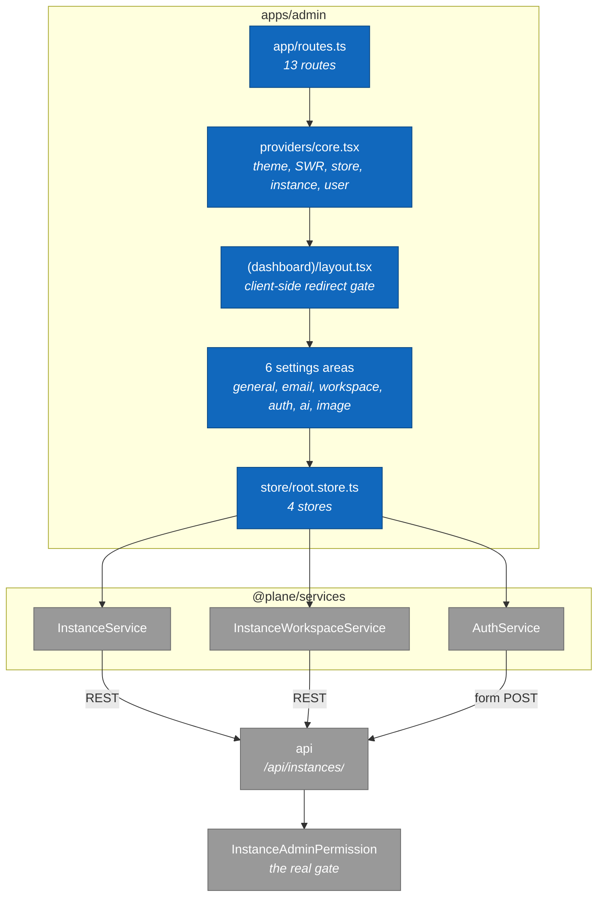

# 3. apps/admin: component map

> **Last reviewed:** 2026-08-13
> **Level:** L3 Components
> **Kind:** Structural
> **Container:** `apps/admin`
> **Scope:** The God Mode SPA. It configures one self-hosted instance. It never touches workspace data.

## 3.1 Diagram

## 3.2 Components

| Component | Path | Responsibility |
| --- | --- | --- |
| Route table | `apps/admin/app/routes.ts` | 13 routes: a home layout with an index, a dashboard layout with 11 pages, and a catch-all |
| Providers | `apps/admin/providers/core.tsx` | Theme, progress bar, toast, SWR, store, instance, user |
| Dashboard gate | `apps/admin/app/(all)/(dashboard)/layout.tsx` | Redirects to `/` when the user is not logged in |
| Home switch | `apps/admin/app/(all)/(home)/page.tsx` | Spinner, failure view, setup form, or sign-in form |
| Stores | `apps/admin/store/root.store.ts` | Four stores: `ThemeStore`, `InstanceStore`, `UserStore`, `WorkspaceStore` |
| Sidebar menu | `apps/admin/hooks/use-sidebar-menu/core.ts` | Declares the six settings areas |
| 6 settings areas | `apps/admin/app/(all)/(dashboard)/` | One page per area: general, email, workspace, authentication, ai, image. Section 3.4 lists what each one writes. |

## 3.3 State

**`RootStore`** (`apps/admin/store/root.store.ts`)

Four stores, against 30 in `apps/web`. The scope is that much smaller.

| Store | Owns |
| --- | --- |
| `ThemeStore` | Light or dark, and the sidebar collapse flag |
| `InstanceStore` | The `Instance` row and every instance configuration key |
| `UserStore` | The signed-in instance admin. Raises `AUTHENTICATION_NOT_DONE` on a 403. |
| `WorkspaceStore` | The workspace list, for the workspace settings page |

## 3.4 What each settings page writes

Every page writes instance configuration keys, which the API stores encrypted in `InstanceConfiguration`.

| Page | Keys |
| --- | --- |
| General | `instance_name`, `is_telemetry_enabled`, admin email addresses |
| Email | `EMAIL_HOST`, `EMAIL_PORT`, `EMAIL_HOST_USER`, `EMAIL_HOST_PASSWORD`, `EMAIL_USE_TLS`, `EMAIL_USE_SSL`, `EMAIL_FROM`, `ENABLE_SMTP` |
| Workspace | `DISABLE_WORKSPACE_CREATION` |
| Authentication | `ENABLE_MAGIC_LINK_LOGIN`, `ENABLE_EMAIL_PASSWORD`, `IS_GOOGLE_ENABLED`, plus GitHub, GitLab, and Gitea |
| AI | `LLM_MODEL`, `LLM_API_KEY` |
| Image | `UNSPLASH_ACCESS_KEY` |

## 3.5 How admin differs from web

| Aspect | `apps/web` | `apps/admin` |
| --- | --- | --- |
| API prefix | `/api/` | `/api/instances/` |
| Identity call | `GET /api/users/me/` | `GET /api/instances/admins/me/` |
| Session cookie | `session-id` | `admin-session-id`, one hour |
| Sign-in | XHR | Native HTML form POST |
| Services | 46 local classes | 4 classes from `@plane/services`: `AuthService`, `InstanceService`, `InstanceWorkspaceService`, `UserService` |
| Stores | 30 | 4 |
| Route prefix | `/` | `/god-mode`, and the proxy does not strip it |

Both set `ssr: false` and ship as static files behind nginx.

## 3.6 Notes

- **The visible gate is client-side only.** `(dashboard)/layout.tsx` redirects on `isUserLoggedIn === false`. The real gate is `InstanceAdminPermission` on the server, which requires an `InstanceAdmin` row with `role >= 15`.
- **The `/god-mode` prefix is baked in at build time** by `VITE_ADMIN_BASE_PATH` in `Dockerfile.admin`. `react-router.config.ts` itself defaults to `/`. Caddy does not strip the prefix, so nginx serves from a `/god-mode` subdirectory.
- **One client call has no server route.** `InstanceService` calls `GET /api/instances/changelog/`, and `plane/license/urls.py` defines no such path. It returns 404 in Community Edition.

## 3.7 Related

| Page | Why it matters here |
| --- | --- |
| [1. apps/api: module map](./01-api-module-map.md) | `plane/license/`, the surface this app calls |
| [2. apps/web: component map](./02-web-component-map.md) | The larger sibling this app is compared against |
| [1. System context](../l1-context/01-system-context.md) | The integrations these settings pages switch on |
