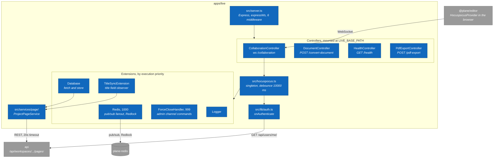

# 4. apps/live: component map

> **Last reviewed:** 2026-08-13
> **Level:** L3 Components
> **Kind:** Structural
> **Container:** `apps/live`
> **Scope:** The real-time collaboration server. Express hosts a Hocuspocus WebSocket server plus three HTTP endpoints. It persists through the REST API, never straight to Postgres.

## 4.1 Diagram

## 4.2 Components

| Component | Path | Responsibility |
| --- | --- | --- |
| Boot | `apps/live/src/start.ts` | Builds the server, handles SIGTERM and SIGINT, exits 1 on a failed boot |
| Server | `apps/live/src/server.ts` | Express with `expressWs`. Middleware: helmet, compression, logger, json, urlencoded, CORS. |
| Env guard | `apps/live/src/env.ts` | Zod validation. Calls `process.exit(1)` on failure. |
| CollaborationController | `src/controllers/collaboration.controller.ts` | The WebSocket upgrade. Hands the socket to Hocuspocus. |
| DocumentController | `src/controllers/document.controller.ts` | `POST /convert-document`, HTML to Yjs binary |
| HealthController | `src/controllers/health.controller.ts` | Returns status, timestamp, version. No dependency check. |
| PdfExportController | `src/controllers/pdf-export.controller.ts` | Requires a `cookie` header. Streams a PDF. |
| Hocuspocus manager | `src/hocuspocus.ts` | Singleton. Five options only: `name`, `onAuthenticate`, `onStateless`, `extensions`, `debounce: 10000`. |
| Authentication | `src/lib/auth.ts` | `onAuthenticate`. Parses the token, forwards the cookie to `GET /api/users/me/`, rejects an id mismatch. |
| Redis manager | `src/redis.ts` | One ioredis client. The extension duplicates it into `pub` and `sub`. |
| Page services | `src/services/page/` | The only path back to `apps/api` for document content |

## 4.3 Extensions

Registration order is not execution order. Hocuspocus sorts by descending `priority`, so two extensions run before the rest.

| Extension | Priority | Does |
| --- | --- | --- |
| Redis | 1000 | Per-document pub/sub channel, awareness fanout, a Redlock write lock, and a custom `hocuspocus:admin` channel |
| ForceCloseHandler | 999 | Handles `FORCE_CLOSE`, sends a stateless warning, waits 50 ms, then closes every connection |
| Logger | 100 | Pipes Hocuspocus logs into `@plane/logger`, with `onChange: false` |
| Database | 100 | `fetch` loads the binary from the API. `store` PATCHes it back. |
| TitleSyncExtension | 100 | Migrates an empty `title` field, then observes it and debounces a PATCH by 5000 ms |

## 4.4 State

This container holds no MobX store. Its state is the set of live `Y.Doc` instances that Hocuspocus keeps in memory, keyed by document name, plus per-document title observers.

Nothing here is durable. Every durable write crosses the REST API.

## 4.5 Notes

- **Redis is a hard startup dependency.** `RedisManager` itself degrades and logs a warning when the URL is empty, but the Redis extension constructor throws `AppError("Redis client not initialized")`, so the whole process exits. Plan for `plane-redis` to be up before `live`.
- **Only one document type works.** `getPageService` accepts `project_page` and throws for anything else. `team_page` and `workspace_page` resolve to an abstract stub whose implementation lives in the enterprise repository.
- **Issue descriptions never use the WebSocket.** They reach `live` only through the stateless `POST /convert-document/` endpoint, which a Celery task calls when duplicating a page or an issue.
- **The health endpoint checks nothing.** It returns 200 without touching Redis or the API, and `Dockerfile.live` declares no `HEALTHCHECK`. Do not treat a 200 here as readiness.

### Three defects worth recording

| Defect | Evidence |
| --- | --- |
| `requireSecretKey` is dead code. It checks `live-server-secret-key`, but no controller applies it and the one API caller sends no header. `/convert-document` and `/pdf-export` are unauthenticated on the internal network. | `src/lib/auth-middleware.ts` |
| The title observer never unsubscribes. `afterUnloadDocument` calls `unobserveDeep`, but Hocuspocus 2.15.2 invokes that hook without the document and destroys the `Y.Doc` first. | `src/extensions/title-sync.ts` |
| The parent-page broadcast branch is unreachable. It is gated on `data?.parentId`, and `afterLoadDocument` only ever writes `userId`, `workspaceSlug`, and `instance`. | `src/extensions/title-sync.ts` |

Test coverage reaches PDF rendering and Effect utilities only. Authentication, the extensions, the Redis fanout, and the store path have no tests.

## 4.6 Related

| Page | Why it matters here |
| --- | --- |
| [1. Document synchronisation](../l4-code/01-document-synchronisation.md) | The call-level trace of the sync algorithm |
| [2. apps/web: component map](./02-web-component-map.md) | Where `HocuspocusProvider` is created |
| [1. Container overview](../l2-containers/01-container-overview.md) | Why `live` writes through `api` and not to `plane-db` |
