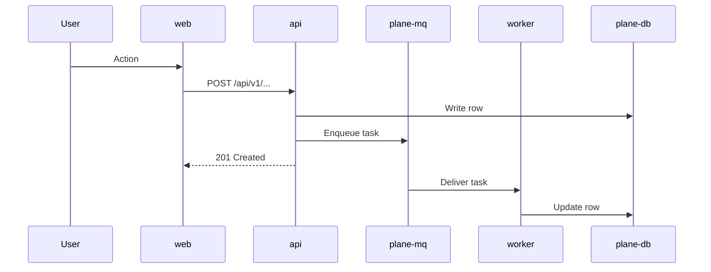

# N. <Concern Title>

> **Last reviewed:** YYYY-MM-DD
> **Units involved:** `apps/api`, `apps/web`, `worker`
> **Scope:** One sentence that states where this flow starts and where it ends.

### Related feature specs

| Spec | Description | Status |
| --- | --- | --- |
| [<Feature name>](../../features/new/<slug>.md) | One-line summary | Shipped / Partial / Draft |

## N.1 Participants

| Participant | Path or service | Role in this flow |
| --- | --- | --- |
| `proxy` | `apps/proxy` | Routes the request by path |
| `web` | `apps/web` | Issues the client call |
| `api` | `apps/api` | Validates, authorizes, and persists |
| `worker` | `apps/api` Celery worker | Runs the deferred work |
| `plane-db` | PostgreSQL 15.7 | Stores the result |

## N.2 Sequence

- **Primary path**: What happens when every step succeeds.
- **Branch**: The main decision point and both outcomes.
- **Design choice**: Something a reader cannot guess from the code.

## N.3 Key code

| Step | Path | Symbol |
| --- | --- | --- |
| Route | `apps/api/plane/app/urls/...` | `<url pattern>` |
| View | `apps/api/plane/app/views/...` | `<ViewClass>` |
| Serializer | `apps/api/plane/app/serializers/...` | `<Serializer>` |
| Model | `apps/api/plane/db/models/...` | `<Model>` |
| Task | `apps/api/plane/bgtasks/...` | `<task_function>` |
| Client call | `apps/web/core/services/...` | `<ServiceClass>` |
| Store | `apps/web/core/store/...` | `<Store>` |

## N.4 Failure modes

| Failure | Observable symptom | Recovery |
| --- | --- | --- |
| <Broker unreachable> | <Task never runs, no error in the UI> | [<SOP name>](../../sops/<slug>-sop.md) |
| <Migration not applied> | <500 on first request to the endpoint> | <Steps or SOP link> |

## N.5 Configuration

| Variable | Default | Effect |
| --- | --- | --- |
| `<ENV_VAR>` | `<default>` or `no default` | What changes when you set it |

Canonical list: [`.env.example`](../../../.env.example) and [`apps/api/.env.example`](../../../apps/api/.env.example).

## N.6 Verification

- **Tests**: `apps/api/tests/...`, `apps/web/...`
- **Command**: The exact command that exercises the flow.
- **Manual check**: The observable result that proves the flow works.

## N.7 Related pages

| Page | Why it matters here |
| --- | --- |
| [<C4 level>](../c4/<level>.md) | The container boundary this flow crosses |
| [<Application page>](../application/NN-slug.md) | File-level detail inside one app |
| [<Security page>](../../security/NN-slug.md) | The restriction enforced in this flow |
