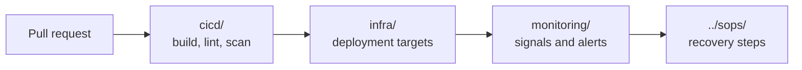

# DevOps

How Plane ships, where it runs, and how a problem gets noticed.

Read [`AGENTS.md`](./AGENTS.md) before you add a page.

## Areas

| Area | Answers | Index |
| --- | --- | --- |
| **CI/CD** | Which pipeline runs, when, and what it blocks | [cicd/INDEX.md](./cicd/INDEX.md) |
| **Monitoring** | Which signal exists and which alert fires | [monitoring/INDEX.md](./monitoring/INDEX.md) |
| **Infra** | Which deployment target exists and what it contains | [infra/INDEX.md](./infra/INDEX.md) |

## Shape against steps

| You want | Go to |
| --- | --- |
| To know what a pipeline does | [cicd/INDEX.md](./cicd/INDEX.md) |
| To know which alert means what | [monitoring/INDEX.md](./monitoring/INDEX.md) |
| To know what a deployment target contains | [infra/INDEX.md](./infra/INDEX.md) |
| The exact steps to perform a task | [../sops/INDEX.md](../sops/INDEX.md) |

## Related

- [../architecture/c4/INDEX.md](../architecture/c4/INDEX.md) draws the containers these targets deploy.
- [../security/INDEX.md](../security/INDEX.md) lists infrastructure and secret controls.
- [../sops/INDEX.md](../sops/INDEX.md) holds every operational procedure.
