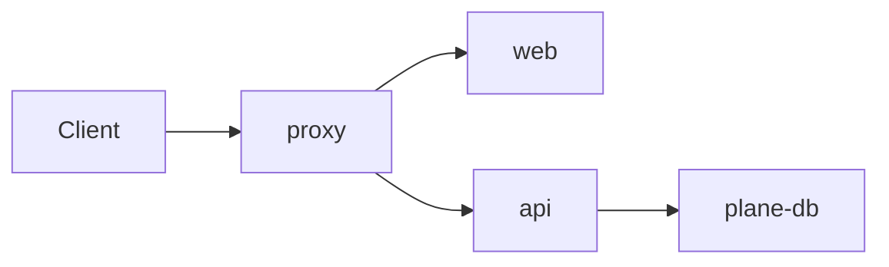

# N. <Target Title>

> **Last reviewed:** YYYY-MM-DD
> **Source:** `<path to the compose file, chart, or deployment folder>`
> **Availability:** Community | Commercial | Both

## N.1 When to use

Two sentences. State the case this target serves, and the case it does not.

## N.2 Components

Every service in the source file needs one row. Copy the pin character for character.

| Service | Image or build context | Pin | Port | Role | Availability |
| --- | --- | --- | --- | --- | --- |
| `proxy` | `apps/proxy` | - | 80, 443 | Caddy ingress and TLS | Both |
| `plane-db` | `postgres` | `15.7-alpine` | 5432 | Primary data store | Both |

Source of these pins: `<path>`.

## N.3 Volumes and state

| Volume | Mounted by | Holds | Loss impact |
| --- | --- | --- | --- |
| `pgdata` | `plane-db` | Every workspace and work item row | Total data loss |
| `uploads` | `plane-minio` | Attachments and avatars | Attachments unavailable |

## N.4 Network and ingress

Routes come from `apps/proxy/Caddyfile.ce`. Keep this table in sync with that file.

| Path | Routes to | Notes |
| --- | --- | --- |
| `/spaces/*` | `space:3000` | Published boards and intake forms |
| `/god-mode/*` | `admin:3000` | Instance admin |
| `/live/*` | `live:3000` | Collaboration WebSocket |
| `/api/*`, `/auth/*`, `/static/*` | `api:8000` | REST API, auth, static assets |
| `/{$BUCKET_NAME}/*` | `plane-minio:9000` | Object storage |
| `/*` | `web:3000` | Workspace app, catch-all |

## N.5 Required configuration

Names only. Never write a value.

| Variable | Default | Effect |
| --- | --- | --- |
| `<ENV_VAR>` | `<default>` or `no default` | What breaks when it is unset |

Canonical list: [`.env.example`](../../../.env.example) and [`apps/api/.env.example`](../../../apps/api/.env.example).

## N.6 Resource floor

State numbers. If untested, write `untested`.

| Resource | Minimum | Note |
| --- | --- | --- |
| vCPU | <n> | <What degrades below this> |
| Memory | <n> GB | <What fails below this> |
| Disk | <n> GB | <Growth rate> |

## N.7 Verification

- **Start**: `<command>`
- **Health check**: `<command>` returns `<expected output>`
- **Teardown**: `<command>`

## N.8 Failure modes

| Failure | Symptom | Recovery |
| --- | --- | --- |
| <Migration not applied> | <500 on every API request> | <Command or SOP link> |

## N.9 Related

| Page | Why it matters here |
| --- | --- |
| [<C4 deployment>](../../architecture/c4/<level>.md) | How containers map to this target |
| [<SOP>](../../sops/<slug>-sop.md) | Install and upgrade steps |
| [<CI page>](../cicd/<slug>.md) | The pipeline that builds these images |
