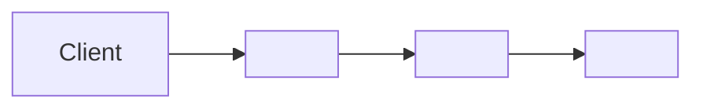

# N. <Target Title>

> **Last reviewed:** YYYY-MM-DD
> **Source:** `<path to the compose file, chart, or deployment folder>`
> **Availability:** Community | Commercial | Both

## N.1 When to use

Two sentences. State the case this target serves, and the case it does not.

## N.2 Components

Every service in the source file needs one row. Copy the pin character for character.

| Service | Image or build context | Pin | Port | Role | Availability |
| --- | --- | --- | --- | --- | --- |
| `<service>` | `<image or context>` | `<pin, or ->` | <port> | <What it does> | Community / Commercial / Both |

Source of these pins: `<path>`. Read each pin from that file, never from another doc.

## N.3 Volumes and state

| Volume | Mounted by | Holds | Loss impact |
| --- | --- | --- | --- |
| `<volume>` | `<service>` | <What it holds> | <What is lost if it goes> |

## N.4 Network and ingress

Read every route from the proxy configuration for this target, for example `apps/proxy/Caddyfile.ce`. Keep this table in sync with that file.

| Path | Routes to | Notes |
| --- | --- | --- |
| `<path pattern>` | `<service>:<port>` | <What it serves> |

## N.5 Required configuration

Names only. Never write a value.

| Variable | Default | Effect |
| --- | --- | --- |
| `<ENV_VAR>` | `<default>` or `no default` | What breaks when it is unset |

Canonical list: [`.env.example`](../../../.env.example) and [`apps/api/.env.example`](../../../apps/api/.env.example).

## N.6 Resource floor

State numbers. If untested, write `untested`.

| Resource | Minimum | Note |
| --- | --- | --- |
| vCPU | <n> | <What degrades below this> |
| Memory | <n> GB | <What fails below this> |
| Disk | <n> GB | <Growth rate> |

## N.7 Verification

- **Start**: `<command>`
- **Health check**: `<command>` returns `<expected output>`
- **Teardown**: `<command>`

## N.8 Failure modes

| Failure | Symptom | Recovery |
| --- | --- | --- |
| <Migration not applied> | <500 on every API request> | <Command or SOP link> |

## N.9 Related

| Page | Why it matters here |
| --- | --- |
| [<L2 structural page>](../../architecture/c4/l2-containers/NN-slug.md) | How containers map to this target |
| [<SOP>](../../sops/<slug>-sop.md) | Install and upgrade steps |
| [<CI page>](../cicd/<slug>.md) | The pipeline that builds these images |
