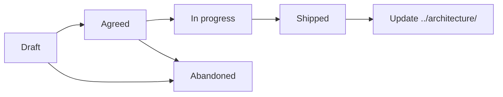

# Features

What we plan to build or change, and why. A page here is a specification. It is not a description of the current system.

## Sub-folders

| Sub-folder | Holds | Index |
| --- | --- | --- |
| **New** | A capability that does not exist yet | [new/INDEX.md](./new/INDEX.md) |
| **Changes** | A change to behavior that already ships | [changes/INDEX.md](./changes/INDEX.md) |
| **Bugfixes** | A defect: the system does not do what it claims | [bugfixes/INDEX.md](./bugfixes/INDEX.md) |

## Which one

[`AGENTS.md`](./AGENTS.md) gives the questions that pick the sub-folder, and the boundary case where a defect belongs in `changes/`.

## Status values

Every page carries one status in its header block. [`AGENTS.md`](./AGENTS.md) defines the five values and the rule for an abandoned page.

## Lifecycle

When a page reaches `Shipped`, update the matching architecture page in the same pull request. The architecture page describes the built result, not the proposal.

## Related

- [../architecture/INDEX.md](../architecture/INDEX.md) describes what exists today.
- [../security/INDEX.md](../security/INDEX.md) lists the restrictions a change can affect.
- [../../CONTRIBUTING.md](../../CONTRIBUTING.md) covers the pull request process.
