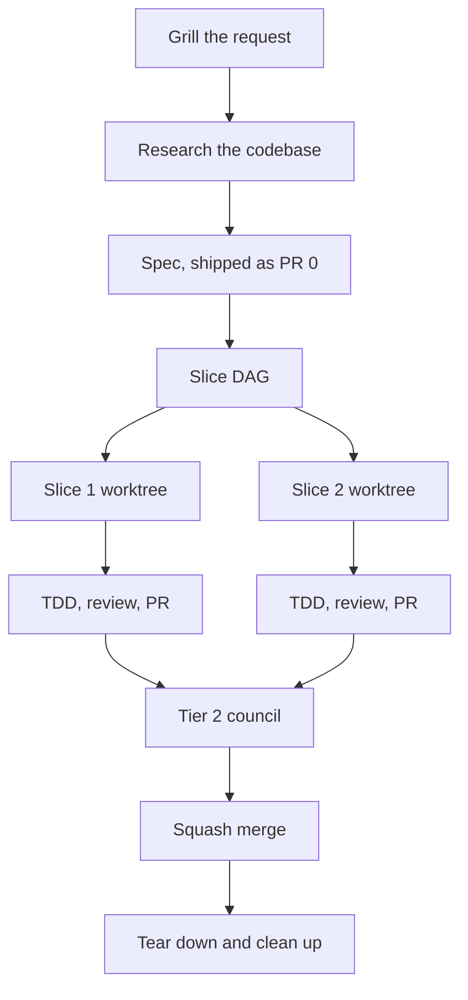

# Develop a Feature SOP

> **Last reviewed:** 2026-08-14
> **Owner role:** Engineer
> **Risk:** Medium
> **Approval:** Not required. Step 7 destroys an environment, so read its warning.

## Purpose

Take a feature request from a first sentence to a merged stack of reviewed pull
requests, one slice at a time, each slice isolated in its own worktree.

## When to use

- **Trigger**: A request to build a capability, change a behavior, or fix a defect
  that touches more than one layer.
- **Do not use this SOP when**: The change is a one-line fix, or it touches one
  file. Branch, fix, and open one pull request. The slice machinery costs more than
  it returns.

## The shape of the work



| Phase              | Skill that owns it                           | Leaves behind                              |
| ------------------ | -------------------------------------------- | ------------------------------------------ |
| Grill and research | `plan-feature`, `plane-explorer`             | Answers and a named precedent              |
| Spec               | `plan-feature`                               | A page in `docs/features/` and PR 0        |
| Slice              | `develop-slice`, `plane-env-create`          | A worktree, a stack, a failing test        |
| Review             | `review-council`, the two reviewer subagents | Findings, fixed or deferred in writing     |
| Pull request       | `create-pull-request`                        | A pull request based on the slice below it |
| Cleanup            | `plane-env-teardown`                         | Nothing. That is the point.                |

## Prerequisites

Complete every item before step 1.

| Item                       | How to confirm                                       |
| -------------------------- | ---------------------------------------------------- |
| Docker is running          | `docker ps` exits 0                                  |
| `lsof` is on PATH          | `command -v lsof`                                    |
| `gh` is authenticated      | `gh api user --jq .login` prints your login          |
| The knowledge graph exists | `test -f graphify-out/graph.json`                    |
| `gh` targets this fork     | `gh repo set-default --view` prints `psarma89/plane` |

## Procedure

1. Grill the request before you plan it. Invoke the `plane-flow:plan-feature`
   skill, or run `/plan-feature`.

   Ask at most five questions. Ask only what changes the plan. State the assumption
   for anything you leave unasked.

   Expected result: You can name the entity, its scope, who is allowed to act on
   it, and what the user sees when it fails.

2. Research before you write. Orient with the graph, not with a grep.

   ```bash
   graphify query "{your question}"
   ```

   If the answer needs several searches, delegate to the `plane-explorer`
   subagent. It returns paths and a summary, so the exploration stays out of your
   context.

   Expected result: You can name the closest existing feature and its real file
   path. A spec that names no precedent is not finished.

3. Write the spec, then ship it as the first pull request.

   Pick the sub-folder with the decision table in `docs/features/AGENTS.md`. Use
   that folder's `TEMPLATE.md`. Set `Status` to `Draft`.

   Expected result: A pull request against `dev` that contains only the spec. It
   is the only artifact a reviewer has while slice 1 is still being written.

4. Cut the work into slices, in the spec, along this spine.
   1. Data model changes.
   2. Backend service and API changes.
   3. Frontend changes.

   Every slice names its files, its dependency, its proof, and its seam. Place
   work that does not fit the spine by judgment, and record the reason.

   Expected result: A `## Slices` section where every row names at least one real
   path.

5. Build one slice. Repeat this step once per slice.

   Run dependent slices in sequence. Run independent slices in parallel, one
   worktree each.
   1. Create the environment.

      ```bash
      .claude/skills/plane-env-create/scripts/env-create.sh <branch>
      ```

      Expected result: The script prints a worktree path, a port block, a sign-in
      email, and a password. `cd` into the path it prints.

      Skip the stack when the slice changes only types, docs, or a pure function.
      Create the worktree with `git worktree add` instead. A stack boot costs
      several minutes.

   2. Write the test. Run it. Show it fail.

      For `apps/api`, set the test project name first.

      ```bash
      source .plane-env.sh
      export COMPOSE_PROJECT_NAME="$PLANE_TEST_PROJECT_NAME"
      ```

      Expected result: The test fails. A test that passes before the
      implementation exists measures nothing.

   3. Write the minimum code that turns the test green.

      Expected result: The test passes, and the files changed match the slice's
      file list.

   4. Read the diff yourself. Then run the review tier.

      Invoke `review-council`. It routes to `plane-django-reviewer` or
      `plane-web-reviewer` by path, and runs `/code-review`, `/security-review`,
      `/simplify`, and a Codex pass.

      Expected result: Every finding is fixed, rejected as a listed false
      positive, or deferred in writing on the pull request.

   5. Open the pull request with `create-pull-request`.

      Expected result: The pull request is based on the slice below it, and
      `git diff <base>...HEAD --stat` shows this slice only.

6. Run the Tier 2 council once, against the whole stack, before anything merges.

   `/ultrareview`, `/claude-security:scan`, Opus 5 and Fable 5 separately, and a
   Codex pass at stack scope.

   Expected result: A recorded verdict per reader. If a reader returned nothing,
   prove that it ran.

7. Merge the stack from the bottom up, then clean up.

   > **Destructive:** `env-teardown.sh` removes every container and every named
   > volume of this branch's project, including the uploads volume. Seeding does
   > not recreate an uploaded file. Copy anything you need first.

   ```bash
   gh pr merge <lowest-pr> --squash
   .claude/skills/plane-env-teardown/scripts/env-teardown.sh
   cd ~/Development/plane
   git worktree remove ~/Development/worktrees/plane/<slug>
   git branch -d <branch>
   git push origin --delete <branch>
   git checkout dev && git pull
   ```

   Expected result: `docker compose ls` no longer lists the project, and
   `git worktree list` no longer lists the worktree.

## Verification

Prove the work landed. Do not rely on the absence of an error.

| Check                               | Command                                | Expected                                          |
| ----------------------------------- | -------------------------------------- | ------------------------------------------------- |
| The spec records what shipped       | read the page in `docs/features/`      | `Status` is `Shipped`, with the pull request link |
| Every slice merged                  | `gh pr list --state merged --base dev` | one entry per slice, plus the spec                |
| No stack survives                   | `docker compose ls`                    | the branch project is absent                      |
| No worktree survives                | `git worktree list`                    | only the main checkout and other live branches    |
| No branch survives                  | `git branch -a \| grep <slug>`         | no output                                         |
| The instruction files still resolve | `./bin/check-agents-md`                | `PASS`                                            |
| Every census count still holds      | `./bin/check-counts`                   | `PASS`                                            |
| `dev` is current                    | `git log --oneline -1`                 | the squash commit of the last slice               |

## Rollback

Roll back per slice, not per stack. Each slice is one squash commit on `dev`.

1. Revert the slice.

   ```bash
   git revert <squash-sha>
   ```

2. If the slice added a migration, reverse it before you revert the code.

   ```bash
   # Use the plane-db-downgrade skill. The reversal floor is db 0107.
   ```

3. Update the spec page. Add an `## Implementation note` block that states what
   was reverted and why. Never rewrite the spec to hide it.

## Troubleshooting

| Failure                                              | Cause                                                                           | Fix                                                                                   |
| ---------------------------------------------------- | ------------------------------------------------------------------------------- | ------------------------------------------------------------------------------------- |
| `env-create.sh` refuses with "detached HEAD"         | Every identifier derives from the branch name, and `HEAD` is not a branch       | `git switch -c <name>`, then rerun                                                    |
| Sign-in fails with a CORS error                      | `CORS_ALLOWED_ORIGINS` does not list the web port                               | Rerun `env-create.sh`. Do not hand-edit the port                                      |
| `pnpm dev` binds 3000 instead of the allocated port  | `.plane-env.sh` was not sourced                                                 | `source .plane-env.sh`, then start again                                              |
| `EEXIST` in `packages/propel/dist`                   | `pnpm dev` ran the propel build and dev tasks together                          | Run `pnpm build`, then `pnpm dev`                                                     |
| A test command removed the development stack         | `COMPOSE_PROJECT_NAME` was unset, so both compose files resolved to one project | Export `$PLANE_TEST_PROJECT_NAME` first. Never pass `--remove-orphans`                |
| Two worktrees' test suites hit one database          | The test project name carried no branch suffix                                  | Export `$PLANE_TEST_PROJECT_NAME`, not a fixed name                                   |
| A stacked pull request shows an earlier slice's diff | The base is `dev` rather than the slice below                                   | Set the base to the parent, and record it with `git config branch.<name>.stackparent` |
| `env-teardown.sh` refuses to name a project          | `.env` is gone and no candidate matches a real project                          | Run `docker compose ls`, then pass `COMPOSE_PROJECT_NAME` by hand                     |
| A Codex pass returned nothing                        | The transport failed silently, which looks the same as a clean pass             | Prove it ran. Otherwise substitute a `reviewer` subagent and record the substitution  |

## Related

| Page                                                                   | Why it matters here                                                   |
| ---------------------------------------------------------------------- | --------------------------------------------------------------------- |
| [`local-development-setup-sop.md`](./local-development-setup-sop.md)   | The same ground by hand, including the one-time prerequisites         |
| [`run-backend-tests-sop.md`](./run-backend-tests-sop.md)               | The test stack, and why its project name must carry the branch        |
| [`run-static-checks-sop.md`](./run-static-checks-sop.md)               | The lint, format, and type checks, and which are already red on `dev` |
| [`apply-database-migration-sop.md`](./apply-database-migration-sop.md) | Step 5 for a data-model slice, and the db 0107 reversal floor         |
| [`../features/AGENTS.md`](../features/AGENTS.md)                       | The sub-folder decision table and the `Status` values step 3 uses     |
| [`../../CONTEXT.md`](../../CONTEXT.md)                                 | The product name and code name for every domain word a spec uses      |
