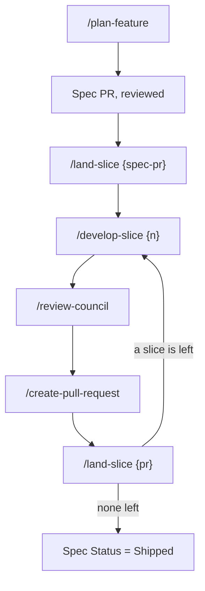

# Develop a Feature SOP

> **Last reviewed:** 2026-08-14
> **Owner role:** Engineer
> **Risk:** Medium
> **Approval:** Not required. Step 4 destroys an environment, so read its warning.

## Purpose

Take a feature request from a first sentence to merged code, one slice at a time.
Each slice is one pull request, written in its own worktree, and landed before the
next one starts.

Four skills carry the work, and each one names the next. This page is the map.

## When to use

- **Trigger**: A request to build a capability, change a behavior, or fix a defect
  that touches more than one layer.
- **Do not use this SOP when**: The change is a one-line fix, or it touches one
  file. Branch, fix, and open one pull request. The slice machinery costs more than
  it returns.

## The shape of the work



Every skill in the chain ends with a `## Next` block that names the following command. Follow that block, and not this page, when the two disagree. The skill sits closer to the work.

| Run                       | It leaves                                                        | Then run                        |
| ------------------------- | ---------------------------------------------------------------- | ------------------------------- |
| `/plan-feature {request}` | A spec page, a slice DAG, and the spec pull request              | `/land-slice {spec-pr}`         |
| `/land-slice {spec-pr}`   | The spec on `dev`                                                | `/develop-slice 1`              |
| `/develop-slice {n}`      | A worktree, a red test turned green, and a reviewed pull request | `/land-slice {pr}`              |
| `/land-slice {pr}`        | Nothing. No stack, no worktree, no branch, and `dev` pulled.     | `/develop-slice {n+1}`, or stop |

`review-council` and `create-pull-request` run inside `/develop-slice`. Invoke either one directly only to repeat a review or to reopen a pull request.

## Prerequisites

Complete every item before step 1.

| Item                       | How to confirm                                       |
| -------------------------- | ---------------------------------------------------- |
| Docker is running          | `docker ps` exits 0                                  |
| `lsof` is on PATH          | `command -v lsof`                                    |
| `gh` is authenticated      | `gh api user --jq .login` prints your login          |
| The knowledge graph exists | `test -f graphify-out/graph.json`                    |
| `gh` targets this fork     | `gh repo set-default --view` prints `psarma89/plane` |

## Procedure

The skills carry the detail. This page carries the order, and the traps that no
single skill can see.

1. Run `/plan-feature {request}` from the main checkout.

   Expected result: A spec pull request that holds only the spec, and a
   `## Slices` section where every row names a real path.

2. Land the spec before slice 1 starts.

   Expected result: The spec is on `dev`, so slice 1 branches from a trunk that
   already holds it.

3. Run `/develop-slice {n}`, once per slice, lowest first.

   Run dependent slices in sequence. Run independent slices in parallel, one
   worktree each.

   Expected result: One pull request per slice, based on `dev`, holding one commit
   whose test failed before the implementation existed.

4. Run `/land-slice {pr}` when review approves that slice. Then return to step 3.

   > **Destructive:** the teardown inside this step removes every container and
   > every named volume of the branch project, including uploads. Seeding does not
   > recreate an uploaded file. Copy anything you need first.

   Expected result: `docker compose ls` and `git worktree list` are both back to
   where they started.

5. Run the Tier 2 council once, before the last slice merges.

   `/ultrareview`, `/claude-security:scan`, Opus 5 and Fable 5 separately, and a
   Codex pass at feature scope.

   Expected result: A recorded verdict for each reader. If a reader returned
   nothing, prove that it ran.

6. Set the spec `Status` to `Shipped`, and record every pull request link in it.

## Four traps

Each one cost a full debugging session. None of them belongs to a single skill.

| Trap                                           | What happens                                                                                                                                                | What to do                                                                                                                         |
| ---------------------------------------------- | ----------------------------------------------------------------------------------------------------------------------------------------------------------- | ---------------------------------------------------------------------------------------------------------------------------------- |
| A skill is not invocable inside a worktree     | Claude Code loads skills from the session project directory. A session started in the main checkout cannot call a skill by name after a `cd` to a worktree. | Run the skills from the main checkout and let them act on the worktree path, or start a session inside the worktree.               |
| A contract test needs the test stack           | `plane-env-create` boots `docker-compose-local.yml`. The pytest suite runs against `docker-compose-test.yml`, which is a separate Compose project.          | Use the `plane-test-api` skill. Export `COMPOSE_PROJECT_NAME="$PLANE_TEST_PROJECT_NAME"` in every shell that runs a test command.  |
| A stacked pull request runs two checks         | Every workflow filters on `branches: [preview, dev]`. A feature-branch base matches no filter, so only `react-doctor.yml` runs, because it declares none.   | Do not stack unless a slice cannot wait. `/land-slice` retargets the base to `dev` before it merges anything.                      |
| A green suite proves nothing about a migration | `apps/api/pytest.ini` sets `--reuse-db` and `--nomigrations`, so the schema comes from the models and the migration never runs.                             | Verify a migration with `sqlmigrate` and the `plane-db-upgrade` skill. Pass `--create-db` on the first run after any model change. |

## Verification

Prove the work landed. Do not rely on the absence of an error.

| Check                               | Command                                       | Expected                                          |
| ----------------------------------- | --------------------------------------------- | ------------------------------------------------- |
| The spec records what shipped       | read the page in `docs/features/`             | `Status` is `Shipped`, with the pull request link |
| Every slice merged                  | `gh pr list --state merged --base dev`        | one entry per slice, plus the spec                |
| No stack survives                   | `docker compose ls`                           | the branch project is absent                      |
| No worktree survives                | `git worktree list`                           | only the main checkout and other live branches    |
| No branch survives                  | `git ls-remote --heads origin \| grep <slug>` | no output. Ask the remote, not the local cache    |
| The instruction files still resolve | `./bin/check-agents-md`                       | `PASS`                                            |
| Every census count still holds      | `./bin/check-counts`                          | `PASS`                                            |
| `dev` is current                    | `git log --oneline -1`                        | the squash commit of the last slice               |

## Rollback

Roll back per slice, not per stack. Each slice is one squash commit on `dev`.

1. Revert the slice.

   ```bash
   git revert <squash-sha>
   ```

2. If the slice added a migration, reverse it before you revert the code.

   ```bash
   # Use the plane-db-downgrade skill. The reversal floor is db 0107.
   ```

3. Update the spec page. Add an `## Implementation note` block that states what
   was reverted and why. Never rewrite the spec to hide it.

## Troubleshooting

| Failure                                              | Cause                                                                                                                 | Fix                                                                                                   |
| ---------------------------------------------------- | --------------------------------------------------------------------------------------------------------------------- | ----------------------------------------------------------------------------------------------------- |
| `env-create.sh` refuses with "detached HEAD"         | Every identifier derives from the branch name, and `HEAD` is not a branch                                             | `git switch -c <name>`, then rerun                                                                    |
| Sign-in fails with a CORS error                      | `CORS_ALLOWED_ORIGINS` does not list the web port                                                                     | Rerun `env-create.sh`. Do not hand-edit the port                                                      |
| `pnpm dev` binds 3000 instead of the allocated port  | `.plane-env.sh` was not sourced                                                                                       | `source .plane-env.sh`, then start again                                                              |
| `EEXIST` in `packages/propel/dist`                   | `pnpm dev` ran the propel build and dev tasks together                                                                | Run `pnpm build`, then `pnpm dev`                                                                     |
| A test command removed the development stack         | `COMPOSE_PROJECT_NAME` was unset, so both compose files resolved to one project                                       | Export `$PLANE_TEST_PROJECT_NAME` first. Never pass `--remove-orphans`                                |
| Two worktrees' test suites hit one database          | The test project name carried no branch suffix                                                                        | Export `$PLANE_TEST_PROJECT_NAME`, not a fixed name                                                   |
| A stacked pull request shows an earlier slice's diff | The base is `dev` rather than the slice below                                                                         | Set the base to the parent, and record it with `git config branch.<name>.stackparent`                 |
| `env-teardown.sh` refuses to name a project          | `.env` is gone and no candidate matches a real project                                                                | Run `docker compose ls`, then pass `COMPOSE_PROJECT_NAME` by hand                                     |
| A Codex pass returned nothing                        | The transport failed silently, which looks the same as a clean pass                                                   | Prove it ran. Otherwise substitute a `reviewer` subagent and record the substitution                  |
| A pull request shows two checks rather than eleven   | The base is a feature branch, and every workflow filters on `[preview, dev]`                                          | `gh pr edit <pr> --base dev`, then push again. `/land-slice` does this before merging                 |
| `gh pr merge --delete-branch` leaves both branches   | A worktree holds the local branch. The local delete fails, so the remote delete never runs, and the exit code stays 0 | `git worktree remove <path>`, then `git branch -D <branch>`, then `git push origin --delete <branch>` |
| A rebased child replays the parent's commits         | The parent merged as a squash commit, so its patch ids changed                                                        | `git rebase --onto origin/dev <old-parent-tip>`, not `git rebase origin/dev`                          |

## Related

| Page                                                                   | Why it matters here                                                      |
| ---------------------------------------------------------------------- | ------------------------------------------------------------------------ |
| [`local-development-setup-sop.md`](./local-development-setup-sop.md)   | The same ground by hand, including the one-time prerequisites            |
| [`run-backend-tests-sop.md`](./run-backend-tests-sop.md)               | The test stack, and why its project name must carry the branch           |
| [`run-static-checks-sop.md`](./run-static-checks-sop.md)               | The lint, format, and type checks, and which are already red on `dev`    |
| [`apply-database-migration-sop.md`](./apply-database-migration-sop.md) | The data-model slice in step 3, and the db 0107 reversal floor           |
| [`../features/AGENTS.md`](../features/AGENTS.md)                       | The sub-folder decision table, and the `Status` values steps 1 and 6 use |
| [`../../CONTEXT.md`](../../CONTEXT.md)                                 | The product name and code name for every domain word a spec uses         |
